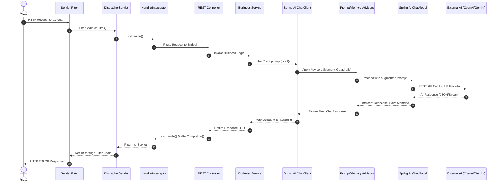

# Complete Overview of Spring AI

Welcome to the ultimate Spring AI curriculum! This project contains step-by-step documentation, architectural diagrams, and interactive coding exercises designed to take you from a curious developer to a production-ready AI engineer using the Spring Ecosystem.

## Request Lifecycle Architecture

Below is the complete end-to-end flow of an incoming request as it travels through the standard Spring Web and Spring AI architecture. It illustrates how the initial HTTP request is processed by filters and dispatchers, routed into the application, augmented by AI Advisors (like Memory and Tokens), sent to the LLM, and returned to the client.

## Table of Contents

### Phase 1: Fundamentals & Getting Started
| Topic | Concept Overview |
|---|---|
| [Topic 1: What is Spring AI](./documentation/Topic-1-What-is-Spring-AI/README.md) | Introduction to the Spring AI framework and its role in modern application development. |
| [Topic 2: Key Features of Spring AI](./documentation/Topic-2-Key-Features-of-Spring-AI/README.md) | Understanding portability, structured outputs, and seamless model integrations. |
| [Topic 3: Integrating OpenAI with Spring Boot](./documentation/Topic-3-Integrating-OpenAI-with-Spring-Boot/README.md) | Setting up API keys and configuring basic ChatGPT API integrations. |
| [Topic 4: Setup Spring AI with Ollama](./documentation/Topic-4-Setup-Spring-AI-with-Ollama/README.md) | Configuring local, private, and free AI model execution using Ollama. |

### Phase 2: Core APIs & Internal Working
| Topic | Concept Overview |
|---|---|
| [Topic 5: ChatClient and ChatModel APIs](./documentation/Topic-5-ChatClient-and-ChatModel-APIs/README.md) | Exploring the primary API interfaces for interacting with Generative models. |
| [Topic 6: Internal Working of ChatClient and ChatModel](./documentation/Topic-6-Internal-Working-of-ChatClient-and-ChatModel/README.md) | Deep dive into the architectural flow and abstraction layers of Spring AI. |
| [Topic 7: Important AI Concepts for Projects](./documentation/Topic-7-Important-AI-Concepts-for-Projects/README.md) | Understanding Tokens, Temperature, Roles, and Context Windows. |
| [Topic 8: Working with Multiple Models Together](./documentation/Topic-8-Working-with-Multiple-Models-Together/README.md) | Using fallback models or combining OpenAI and Google Gemini in a single app. |

### Phase 3: Prompts & Output Parsing
| Topic | Concept Overview |
|---|---|
| [Topic 9: Output Parsing (Entities and Lists)](./documentation/Topic-9-Output-Parsing-Entities-and-Lists/README.md) | Converting raw string AI responses into strictly typed Java POJOs and Lists. |
| [Topic 10: Prompt Defaults in Spring AI](./documentation/Topic-10-Prompt-Defaults-in-Spring-AI/README.md) | Configuring global system prompts and parameters across your entire application. |
| [Topic 11: Dynamic Prompt Templating](./documentation/Topic-11-Dynamic-Prompt-Templating/README.md) | Preventing prompt injection and using safe placeholders in your system constraints. |
| [Topic 12: Mastering Prompt Templates](./documentation/Topic-12-Mastering-Prompt-Templates/README.md) | Loading complex prompts safely from external `.st` Resource files. |

### Phase 4: Production Preparedness & Streaming
| Topic | Concept Overview |
|---|---|
| [Topic 13: Remember This Before Building AI Apps](./documentation/Topic-13-Remember-This-Before-Building-AI-Apps/README.md) | Best practices regarding latency, token limits, and AI unpredictability. |
| [Topic 14: Streaming Responses](./documentation/Topic-14-Streaming-Responses/README.md) | Using Project Reactor `Flux` to send chunked text responses for better UI perceived latency. |
| [Topic 15: Semantic Caching](./documentation/Topic-15-Semantic-Caching/README.md) | Reducing API costs and latency by caching responses to semantically similar queries rather than exact-match keys. |
| [Topic 16: Mocking AI in Unit Tests](./documentation/Topic-16-Mocking-AI-in-Unit-Tests/README.md) | Stubbing out ChatClient and ChatModel responses in JUnit tests for deterministic, cost-free CI pipelines. |

### Phase 5: Advisors & Context (Memory)
| Topic | Concept Overview |
|---|---|
| [Topic 17: Advisors in Spring AI](./documentation/Topic-17-Advisors-in-Spring-AI/README.md) | Utilizing interceptors to automatically manipulate prompts and intercept responses. |
| [Topic 18: Custom Advisor & Token Count](./documentation/Topic-18-Custom-Advisor-Token-Count/README.md) | Tracking API token costs and building custom guardrails using `CallAroundAdvisor`. |
| [Topic 19: Teaching LLMs to Remember (Concept)](./documentation/Topic-19-Teaching-LLMs-to-Remember/README.md) | The theory behind why LLMs have amnesia and how to fix it with historic transcripts. |
| [Topic 20: Implementing Chat Memory](./documentation/Topic-20-Implementing-Chat-Memory/README.md) | Injecting `MessageChatMemoryAdvisor` and `InMemoryChatMemory` into ChatClient. |
| [Topic 21: Manage User Sessions](./documentation/Topic-21-Manage-User-Sessions/README.md) | Isolating memory state per user by dynamically evaluating unique Conversation IDs. |
| [Topic 22: Persistent Chat Memory](./documentation/Topic-22-Persistent-Chat-Memory/README.md) | Using Database-backed repositories like `JdbcChatMemory` to survive server restarts. |
| [Topic 23: Multi-Tenancy & Data Isolation](./documentation/Topic-23-Multi-Tenancy-Data-Isolation/README.md) | Partitioning memory, vector stores, and tool access per enterprise tenant so that customer data never bleeds across accounts. |

### Phase 6: Vector Databases & RAG
| Topic | Concept Overview |
|---|---|
| [Topic 24: Understanding RAG](./documentation/Topic-24-Understanding-RAG/README.md) | Grounding LLMs with private factual data to eliminate guessing and hallucinations. |
| [Topic 25: Vectors and Embeddings](./documentation/Topic-25-Vectors-and-Embeddings/README.md) | Translating textual meaning into mathematical coordinates for `VectorStores`. |
| [Topic 26: Setup Vector DB & Dump Embeddings](./documentation/Topic-26-Setup-Vector-DB/README.md) | Using `VectorStore.accept()` to load documents into your searchable knowledge base. |
| [Topic 27: Similarity Search & Manual RAG](./documentation/Topic-27-Similarity-Search-Manual-RAG/README.md) | The hard way: Using `similaritySearch` and manually packing contexts into Prompts. |
| [Topic 28: QuestionAnswerAdvisor (Auto-RAG)](./documentation/Topic-28-QuestionAnswerAdvisor/README.md) | The Spring way: Automating the retrieval and generation phases with a single Advisor. |
| [Topic 29: Hybrid Search (Keyword + Vector)](./documentation/Topic-29-Hybrid-Search/README.md) | Combining BM25 keyword search with dense vector retrieval to overcome the weaknesses of pure semantic search on short or technical queries. |
| [Topic 30: Metadata Filtering in Vector Stores](./documentation/Topic-30-Metadata-Filtering/README.md) | Scoping similarity searches to specific document subsets using structured metadata predicates, improving relevance and security. |
| [Topic 31: Document Versioning & Re-Indexing](./documentation/Topic-31-Document-Versioning-Reindexing/README.md) | Strategies for updating, replacing, and invalidating stale embeddings when source documents change. |

### Phase 7: Advanced RAG, ETL & Deployment
| Topic | Concept Overview |
|---|---|
| [Topic 32: Advanced RAG Flow](./documentation/Topic-32-Advanced-RAG-Flow/README.md) | Introduction to Pre-retrieval routing and Post-retrieval re-ranking and filtering. |
| [Topic 33: Implementing RAG Pipeline](./documentation/Topic-33-Implementing-RAG-Pipeline/README.md) | Implementing advanced pipelines using Query Optimization via fast LLM calls. |
| [Topic 34: ETL Pipeline in Detail](./documentation/Topic-34-ETL-Pipeline-Detail/README.md) | The theory of Extracting, Transforming (chunking), and Loading AI datasets. |
| [Topic 35: PDF Text To Vector DB](./documentation/Topic-35-PDF-Text-To-Vector-DB/README.md) | Full Controller endpoint reading PDFs (`PagePdfDocumentReader`) and chunking payloads. |
| [Topic 36: Run Local AI Docker](./documentation/Topic-36-Run-Local-AI-Docker/README.md) | Complete detachment from paid APIs by securely running Ollama in a private container. |

### Phase 8: Agents & Function Calling
| Topic | Concept Overview |
|---|---|
| [Topic 37: Tool Calling in LLMs](./documentation/Topic-37-Tool-Calling-in-LLMs/README.md) | Understanding how LLMs execute real-world Java functions via FunctionCallback. |
| [Topic 38: AI Agent using Spring AI](./documentation/Topic-38-AI-Agent-using-Spring-AI/README.md) | Building autonomous agents that orchestrate multiple tools to solve complex goals. |
| [Topic 39: Multi-Agent Orchestration](./documentation/Topic-39-Multi-Agent-Orchestration/README.md) | Designing systems where specialized sub-agents collaborate under a supervisor agent to solve tasks that exceed a single model's scope. |
| [Topic 40: Human-in-the-Loop Workflows](./documentation/Topic-40-Human-in-the-Loop/README.md) | Pausing agentic pipelines at critical decision points to request human approval before executing irreversible actions. |
| [Topic 41: Security & Prompt Injection Defense](./documentation/Topic-41-Security-Prompt-Injection/README.md) | Hardening AI endpoints against adversarial user inputs, jailbreaks, and indirect injection attacks from external data sources. |
| [Topic 42: PII Detection & Redaction](./documentation/Topic-42-PII-Detection-Redaction/README.md) | Automatically scrubbing personally identifiable information from prompts before they leave your infrastructure, using custom Advisors. |

### Phase 9: HelpDesk Real-World Project
| Topic | Concept Overview |
|---|---|
| [Topic 43: HelpDesk Project Part 1](./documentation/Topic-43-HelpDesk-Project-Part-1/README.md) | Bootstrapping a real-world ticketing system with strict HelpBot persona constraints. |
| [Topic 44: HelpDesk Project Part 2](./documentation/Topic-44-HelpDesk-Project-Part-2/README.md) | Integrating database mutation tools (createTicket, checkStatus) into the ChatClient. |
| [Topic 45: HelpDesk Project Part 3](./documentation/Topic-45-HelpDesk-Project-Part-3/README.md) | Fixing hallucinations and isolating user sessions leveraging Chat Memory Advisors. |
| [Topic 46: HelpDesk Project Part 4](./documentation/Topic-46-HelpDesk-Project-Part-4/README.md) | Finishing the backend with streaming SSE Flux responses and JDBC Vector DB Memory persistence. |
| [Topic 47: HelpDesk Frontend React](./documentation/Topic-47-HelpDesk-Frontend-React/README.md) | Building the full-stack UI using React, Tailwind, and ShadcnUI to consume SSE streams. |

### Phase 10: Multi-modal & MCP
| Topic | Concept Overview |
|---|---|
| [Topic 48: Audio Transcription](./documentation/Topic-48-Audio-Transcription-OpenAI/README.md) | Processing `.wav`/`.mp3` voice inputs into text using Spring AI `AudioTranscriptionModel`. |
| [Topic 49: Image Generation (DALL-E & Imagen)](./documentation/Topic-49-Image-Generation-DallE-Imagen/README.md) | Exploring the `ImageModel` to construct Generative Art from text descriptions. |
| [Topic 50: Text-to-Speech (TTS)](./documentation/Topic-50-Text-to-Speech-TTS/README.md) | Delivering voice responses from your bot converting LLM text into spoken MP3 files. |
| [Topic 51: Gemini Integration Guide](./documentation/Topic-51-Gemini-Integration-Guide/README.md) | Deep dive into `spring-ai-google-genai` configuration and evaluating images natively in prompts. |
| [Topic 52: Model Context Protocol (MCP)](./documentation/Topic-52-Model-Context-Protocol-MCP/README.md) | Architecture of MCP transport layers and auto-discovering remote agent tools securely. |
| [Topic 53: Spring AI with Apache Kafka](./documentation/Topic-53-Spring-AI-Kafka/README.md) | Building async, event-driven AI pipelines where inference tasks are produced to Kafka topics and consumed independently for high-throughput decoupling. |

### Phase 11: Production Readiness & Enterprise Features
| Topic | Concept Overview |
|---|---|
| [Topic 54: AI Observability (Micrometer)](./documentation/Topic-54-AI-Observability-Micrometer/README.md) | Tracing AI request latency and logging token/financial costs across microservices. |
| [Topic 55: Evaluating LLM Responses](./documentation/Topic-55-Evaluating-LLM-Responses/README.md) | Writing automated JUnit tests to ensure your AI isn't hallucinating using the Evaluation API. |
| [Topic 56: Resiliency & Rate Limiting](./documentation/Topic-56-Resiliency-and-Rate-Limiting/README.md) | Using Spring Retry to handle HTTP 429 Too Many Requests errors natively. |
| [Topic 57: Cost Budgeting & Hard Token Limits](./documentation/Topic-57-Cost-Budgeting-Token-Limits/README.md) | Enforcing per-request and per-user spending caps using custom Advisors that abort calls exceeding a configured token budget. |
| [Topic 58: Prompt Versioning & Management](./documentation/Topic-58-Prompt-Versioning/README.md) | Treating system prompts as first-class artifacts — versioning, A/B testing, and rolling back prompts independently of application deployments. |
| [Topic 59: Fine-Tuned Model Integration](./documentation/Topic-59-Fine-Tuned-Model-Integration/README.md) | Swapping the base model for a domain-specific fine-tune and managing model identifiers cleanly through Spring AI's `ChatModel` abstraction. |

---
*Curriculum index generated focusing on Spring AI architecture and advanced engineering best practices.*