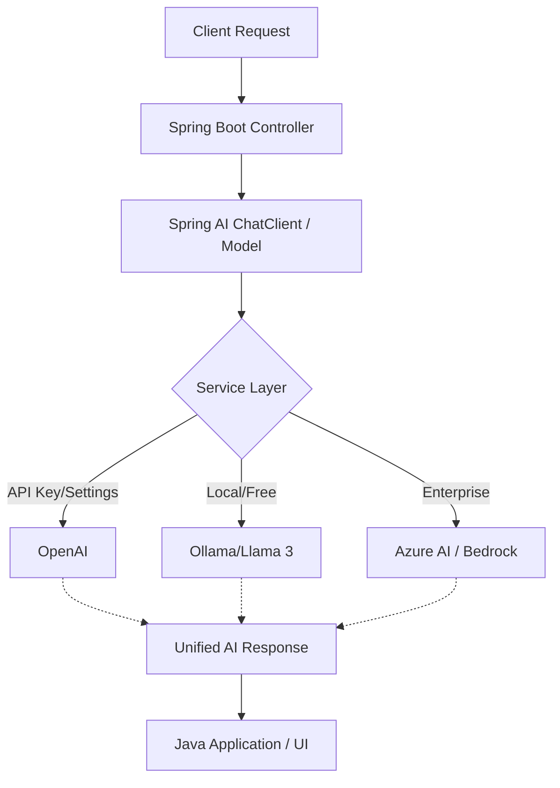

# Topic 1: What is Spring AI? 🚀

### Introduction
**Spring AI** is a groundbreaking framework from the Spring ecosystem designed to simplify the integration of Artificial Intelligence (AI) into Enterprise Java applications. Just as Spring simplified the complexities of JEE (Java Enterprise Edition), Spring AI simplifies the complexities of working with various AI models (LLMs like OpenAI, Gemini, Hugging Face) by providing a unified, portable, and standard API.

---

### 🎨 Real-World Analogy: The Universal Charging Port (USB-C)

Imagine you have multiple electronic devices (iPhone, Android, Laptop, Camera). In the old days, each device needed a specific, unique charger. If you switched your phone from Brand A to Brand B, your old charger was useless.

*   **Before Spring AI:** Integrating AI was like the old days. If you wrote code for OpenAI and wanted to switch to Google Gemini, you had to rewrite 50% of your integration logic because their APIs were completely different.
*   **With Spring AI:** Spring AI is the **USB-C charger**. It provides a common interface. You plug in your "power cable" (the Spring AI API), and it doesn't matter if the "device" on the other end is OpenAI, Azure AI, or Ollama. You can swap them out with just a configuration change, without rewriting your core business logic.

---

### 🧠 Why we need Spring AI? (Problem vs Solution)

| Aspect | Traditional Approach (Manual API Call) | Spring AI Approach |
| :--- | :--- | :--- |
| **Portability** | Hardcoded to one provider. Switching is painful. | **Model Agnostic**. Swap providers in properties. |
| **Prompt Management** | String concatenation (messy and error-prone). | **Prompt Templates** (Structured & Reusable). |
| **Data Mapping** | Manual JSON parsing of complex AI responses. | **Output Parsers** (Map AI JSON directly to Java POJOs). |
| **Documentation** | Scattered across different provider sites. | Unified **Spring-style** documentation and community. |

---

### 🛠️ The Architecture Flow

Here is how Spring AI sits between your application and the AI models:

---

### 🔑 Key Concepts to Remember

1.  **AI Model Interoperability:** Support for multiple providers (OpenAI, Microsoft, Amazon AWS, Google, etc.).
2.  **Portable API:** Use standard interfaces like `ChatModel`, `EmbeddingModel`, and `ImageModel`.
3.  **Prompts & Templates:** A structured way to communicate instructions to AI models.
4.  **Vector Stores & RAG:** Built-in support for "Retrieval Augmented Generation" to allow AI to talk to your private data.

---

### 🏁 Summary
Spring AI is not just another library; it's a **Design Pattern** for the future of Java development. It allows you to build AI-powered features (Chatbots, Data Analyzers, Image Generators) while keeping your code clean, modular, and vendor-neutral.
