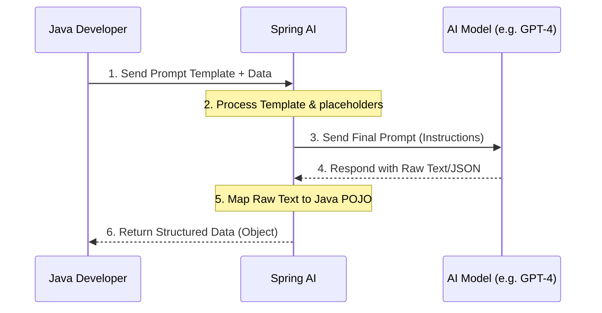

# Topic 2: Key Features of Spring AI 🗝️

Spring AI is not just a wrapper for API calls; it’s a full-featured framework that introduces common patterns for AI development. Let's look at the "Big 4" features that make it essential for Java developers.

---

### 🎨 Real-World Analogy: The Restaurant Menu

Think of building an AI application like running a restaurant.
- **Model Agnostic**: You have several suppliers (Providers like OpenAI, Anthropic, etc.). If one supplier raises prices or has a shortage, you just switch to another without changing your recipes (**Model Agnosticism**).
- **Prompt Template**: Instead of writing the recipe from scratch every time, you have a **standard template** where you just swap out the ingredients.
- **Output Parser**: After the meal is cooked, the **Plate Presentation (Output Parser)** ensures it's served in a way the customer (your application code) can easily consume (as a Java object/POJO).
- **ETL for RAG**: Your chef has a **Library of Specialized Books (Vector DB)** that they can consult to answer highly specific questions that aren't on the standard menu.

---

### 🌟 Feature Breakdown

#### 1. 🌍 Model Agnostic (Interchangeability)
Spring AI provides a unified interface for all major AI models.
- **How it works:** You use the `ChatModel` interface in your Java code.
- **Advantage:** You can switch from OpenAI to Azure AI or Ollama by just changing a dependency and a line in `application.properties`.

#### 2. 📝 Prompt Templates
Writing complex prompts as simple strings is messy. Spring AI uses templates with placeholders.
```java
String template = "Translate the text: {text} into {language}.";
PromptTemplate promptTemplate = new PromptTemplate(template);
Prompt prompt = promptTemplate.create(Map.of("text", "Hello", "language", "Hindi"));
```

#### 3. 🧩 Output Parsers (Structured Output)
Large Language Models (LLMs) return raw text. But for a Java app, we need structured data (JSON, POJO, List).
- **How it works:** You define a Java record or class, and Spring AI tells the LLM to format the response so that it can automatically be mapped into that Java object.

#### 4. 📚 Advanced RAG Support (Retrieval Augmented Generation)
RAG allows the AI to "read" your custom data (PDFs, Databases, Documents).
- **Embedded ETL Pipeline:** Spring AI provides a built-in process to:
    - **Load** (Read documents)
    - **Transform** (Split text into chunks)
    - **Embed** (Convert text to numbers/vectors)
    - **Store** (Save in Vector Databases like Pinecone, Redis, PGVector)

---

### 🧠 Flow Diagram: The AI Request Lifecycle



---

### 🏁 Summary of Key Benefits

| Feature | Key Benefit |
| :--- | :--- |
| **Model Agnostic** | No vendor lock-in. Future-proof code. |
| **Prompt Templates** | Clean, reusable, and manageable prompt logic. |
| **Output Parsers** | Type-safety. No manual JSON parsing code. |
| **RAG Support** | AI can chat with *your* private enterprise data. |

---

### Next Up...
In Topic 3, we will see these features in action by creating our **First AI Project** integrating with OpenAI!
