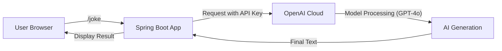

# Topic 3: First AI Project (OpenAI) 🤖

Ready to build? Your first step into Spring AI starts with integrating OpenAI. Let's build a simple **"Text-to-Translation" or "Quote-Generation" service**.

---

### 🎨 Real-World Analogy: Ordering at Starbucks

Think of OpenAI as a specialized barista.
- **API Key**: This is your **Loyalty Card** or Credit Card. You need it to order.
- **Prompt**: This is your **Order**. "I'd like a Tall Latte, no foam, with caramel drizzle."
- **ChatModel**: The **Waitress/POS System** that takes your order and delivers it to the Barista (OpenAI) and brings the drink back to you.

---

### 🧪 Integration Steps

#### 1. ⚙️ Prerequisites
You'll need an OpenAI API Key.
- Sign up at: [platform.openai.com](https://platform.openai.com/)
- Create a new Secret Key.

#### 2. 📁 Add Dependencies (`pom.xml`)
We use the official Spring AI OpenAI starter.
```xml
<dependency>
    <groupId>org.springframework.ai</groupId>
    <artifactId>spring-ai-openai-spring-boot-starter</artifactId>
</dependency>
```

#### 3. 📝 Configuration (`application.properties`)
Store your API Key here.
```properties
spring.ai.openai.api-key=REPLACE_WITH_YOUR_KEY
spring.ai.openai.chat.options.model=gpt-4o
```

#### 4. 👨‍💻 Writing Code (`ChatController.java`)
Spring AI injects the `ChatModel` (the smart engine) for you!
```java
@RestController
public class AIController {

    private final ChatModel chatModel;

    public AIController(ChatModel chatModel) {
        this.chatModel = chatModel;
    }

    @GetMapping("/joke")
    public String generateJoke(@RequestParam(defaultValue = "tell me a joke about Java") String message) {
        // chatModel.call() is the magic function that sends message to OpenAI
        return chatModel.call(message);
    }
}
```

---

### 🧠 Flow Diagram: The OpenAI Workflow



---

### 💡 Core Components Explained

- **`ChatModel`**: The main interface you interact with. It manages everything like networking and JSON formatting.
- **`@Value` or Properties**: Essential for securing your API Key. **Never hardcode personal keys inside code!**
- **Starter dependency**: Handles all the behind-the-scenes configuration automatically. Just by adding it to your `pom.xml`, Spring Boot knows how to talk to OpenAI.

---

### 🛑 Common Errors & Fixes
- **401 Unauthorized**: Your API Key is missing or invalid. Check your `application.properties`.
- **429 Rate Limit**: You've run out of free trial credits or made too many requests. Check your budget on OpenAI's dashboard.
- **500 Model Unavailable**: OpenAI's servers might be down or you're using a model name (like gpt-4) that your account doesn't have access to yet.

---

### 🏁 Summary
Congratulations! You've just integrated a world-class AI into a standard Java application with less than **10 lines of code**. That's the power of Spring AI!
