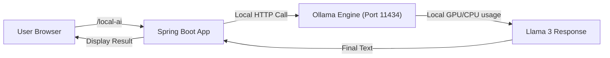

# Topic 4: Setup with Free LLM (Ollama) 🌋

Want to run AI for free, offline, and with 100% privacy? This is where **Ollama** and Spring AI come in. Let's learn how to run a powerful LLM like Llama 3 or Mistral directly on your laptop.

---

### 🎨 Real-World Analogy: The Coffee Machine (Nespresso)

- **OpenAI** (Topic 3) was like going to a café. You pay per drink, you don't own the equipment, but the coffee is high-quality.
- **Ollama** is like owning a **Nespresso machine** at home.
    - You buy the machine once (**Install Ollama**).
    - You buy the pods (**Download Llama 3 model**).
    - After that, the coffee is **free**, and you can drink as much as you want without leaving your house (**No Internet/No Cost**).

---

### 📁 Prerequisites: Installing Ollama
Before you write any Java code, you need the Ollama engine running on your machine:
1.  Download from [ollama.com](https://ollama.com/).
2.  Install it (Windows/macOS/Linux).
3.  Open your terminal and run:
    ```bash
    ollama run llama3
    ```
    This downloads and starts the Llama 3 model locally. Once it's running, you're ready!

---

### 🧪 Integration Steps

#### 1. 📁 Add Dependencies (`pom.xml`)
We use the official Spring AI Ollama starter.
```xml
<dependency>
    <groupId>org.springframework.ai</groupId>
    <artifactId>spring-ai-ollama-spring-boot-starter</artifactId>
</dependency>
```

#### 2. 📝 Configuration (`application.properties`)
Ollama runs on a local port (default: 11434).
```properties
spring.ai.ollama.base-url=http://localhost:11434
spring.ai.ollama.chat.options.model=llama3
```

#### 3. 👨‍💻 Writing Code (`OllamaController.java`)
The code remains almost identical to OpenAI because of **Model Agnosticism**.
```java
@RestController
public class LocalAIController {

    private final ChatModel chatModel;

    public LocalAIController(@Qualifier("ollamaChatModel") ChatModel chatModel) {
        this.chatModel = chatModel;
    }

    @GetMapping("/local-ai")
    public String askLocalAI(@RequestParam String prompt) {
        return chatModel.call(prompt);
    }
}
```

---

### 🧠 Flow Diagram: The Local AI Lifecycle



---

### 🌟 Why use Ollama/Local LLMs?
- **💰 100% Free**: No recurring API bills or usage limits.
- **🔒 Privacy**: Your data never leaves your computer. Perfect for processing sensitive documents.
- **🛰️ Offline**: Works without an internet connection.
- **⚡ Performance**: If you have a strong GPU (NVIDIA RTX or Apple M-series), it can be incredibly fast.

---

### 🛑 Troubleshooting
- **Model not found**: Run `ollama pull [model-name]` in your terminal to download it.
- **Connection Refused**: Make sure the Ollama app is actually running in your system tray.
- **Wait... it's slow!**: LLMs require a lot of RAM and GPU power. If your computer stays stuck, try a smaller model like `tinyllama` or `phi3`.

---

### 🏁 Summary
Running local AI with Spring AI is as simple as running cloud AI. You've now mastered both worlds—Cloud (OpenAI) and Local (Ollama). You are officially a Spring AI Expert! 🎓
