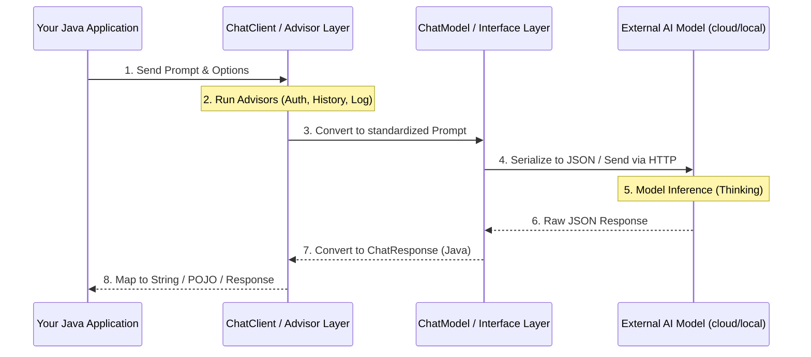

# Topic 6: Internal Working of ChatClient & ChatModel ⚙️

Ever wondered what happens behind the scenes when you call `.call()` in Spring AI? Let's peel back the layers to see how a simple Java request becomes an AI-generated response.

---

### 🎨 Real-World Analogy: The Travel Agency

1.  **Preparation (User Request)**: You go to a travel agent saying, "I want a beach vacation in Hawaii."
2.  **The Form-Filler (Serialization)**: The agent translates your request into a formal system entry.
3.  **The Quality Check (Advisors)**: A supervisor checks if you have a passport (Security Advisor) and if you've been there before (History Advisor) before the request is sent.
4.  **The International Call (The API request)**: The agent calls the international hotel system (OpenAI/Google API).
5.  **The Translation (Parsing)**: The hotel system responds in a foreign format (JSON), and the agent translates it back into a clear "Voucher" (Java Object) for you.

---

### 🧠 Flow Diagram: The Request Lifecycle

---

### 📝 The Core Processing Steps

#### 1. 🛫 Transformation & Templating
Your `Map<String, Object>` of data is merged into the `PromptTemplate`. This creates a final, formatted string that the AI will understand.

#### 2. 🛡️ Advisors (The Pipeline)
Before the model is called, Spring AI runs all registered "Advisors."
- **Example**: A `MessageCorrelationAdvisor` adds a unique ID for tracing.
- **Example**: A `ChatMemoryAdvisor` pulls the last 5 messages from the database and injects them as history for context.

#### 3. 🌐 Serialization & Network Request
The `ChatModel` (e.g., `OpenAiChatModel`) takes the prompt and converts it into the exact JSON schema required by the provider (OpenAI, Gemini, Bedrock). It then uses a **RestTemplate** or **WebClient** to make the HTTP POST request.

#### 4. 🛬 Mapping & Parsing
The raw JSON returned (which contains metadata like tokens used, finish reasons, and the message content) is mapped back into a `ChatResponse` Java object.

#### 5. 🧩 Content Processing
If you use `.entity(MyRecord.class)`, Spring AI uses a `BeanOutputParser` to take the final text response from the model and use **Jackson** to deserialize it into your Java class.

---

### 🌟 Why this matters to you?
- **Debugging**: Now you know where to place breakpoints (Advisors vs Model calls).
- **Customization**: You can write your own Advisors (e.g., a "Privacy Advisor" to mask emails before sending prompts).
- **Testing**: You can mock the `ChatModel` to test your application without spending AI credits.

---

### 🏁 Summary
Spring AI isn't black magic. It's a structured pipeline that ensures **Portability** (by standardizing formats), **Security** (via advisors), and **Productivity** (by handling JSON-to-Java mapping).
