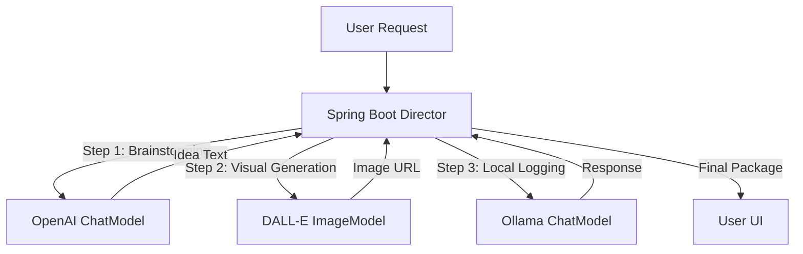

# Topic 8: Working with Multiple Models Together 🤝

In a real-world project, you rarely use just one model. You might use **GPT-4o** for complex reasoning, **Gemini** for its large context window, and **DALL-E** for generating images. Spring AI makes it incredibly easy to "Mix and Match" models in a single project.

---

### 🎨 Real-World Analogy: The Dream Team

Think of your application as a **Movie Production Crew**:
1.  **The Script Writer (OpenAI GPT-4)**: Elite writing and logic.
2.  **The Visual Effects Artist (OpenAI DALL-E 3)**: Creates stunning images based on the script.
3.  **The Translator (Google Gemini)**: Handles multi-language subtitles efficiently.
4.  **The Local Intern (Ollama / Llama 3)**: Handles quick, non-sensitive tasks for free (like spell-checking).

You (the developer) are the **Director**, telling each expert when to perform their task.

---

### 🧠 Flow Diagram: Orchestration Workflow



---

### 🛠️ Configuration for Multiple Models

You can include multiple starters in your `pom.xml`.

```xml
<!-- OpenAI Starter -->
<dependency>
    <groupId>org.springframework.ai</groupId>
    <artifactId>spring-ai-openai-spring-boot-starter</artifactId>
</dependency>

<!-- Ollama Starter -->
<dependency>
    <groupId>org.springframework.ai</groupId>
    <artifactId>spring-ai-ollama-spring-boot-starter</artifactId>
</dependency>
```

#### 📝 `application.properties`
```properties
# OpenAI Config
spring.ai.openai.api-key=${OPENAI_API_KEY}

# Ollama Config (Local)
spring.ai.ollama.base-url=http://localhost:11434
```

---

### 👨‍💻 Orchestration in Java

Spring AI provides `@Qualifier` to distinguish between different models when multiple are present.

```java
@Service
public class MultiModelService {

    private final ChatModel openAiModel;
    private final ChatModel ollamaModel;
    private final ImageModel imageModel;

    public MultiModelService(
            @Qualifier("openAiChatModel") ChatModel openAiModel,
            @Qualifier("ollamaChatModel") ChatModel ollamaModel,
            ImageModel imageModel) {
        this.openAiModel = openAiModel;
        this.ollamaModel = ollamaModel;
        this.imageModel = imageModel;
    }

    public AiResponse generateContent(String topic) {
        // Step 1: Use OpenAI for high-quality text
        String story = openAiModel.call("Write a pitch for a story about " + topic);

        // Step 2: Use DALL-E for a cover image
        ImageResponse image = imageModel.call(new ImagePrompt("A cinematic cover for: " + topic));

        // Step 3: Use Ollama to log locally (No cost)
        ollamaModel.call("Logging content creation for topic: " + topic);

        return new AiResponse(story, image.getResult().getOutput().getUrl());
    }
}
```

---

### 🌟 Advanced Scenario: Fallback Support
You can create a "Smart Fallback" system. If OpenAI fails (due to budget or outage), your code can automatically catch the exception and call Ollama as a backup.

#### 💡 Fallback Logic Example:
```java
public String askAI(String prompt) {
    try {
        return openAiModel.call(prompt); // Primary
    } catch (Exception e) {
        return ollamaModel.call(prompt); // Free Backup
    }
}
```

---

### 🏁 Summary
- **Independence**: Each model lives in its own "Starter" but works under a unified API.
- **Portability**: You can swap out your "Script Writer" from OpenAI to Anthropic by just changing a qualifier and properties.
- **Cost/Privacy Balance**: Use Cloud models for the heavy-lifting and Local models for background processing.

**Congratulations!** You now know how to build complex, multi-model AI systems using the Spring framework. 🚀
