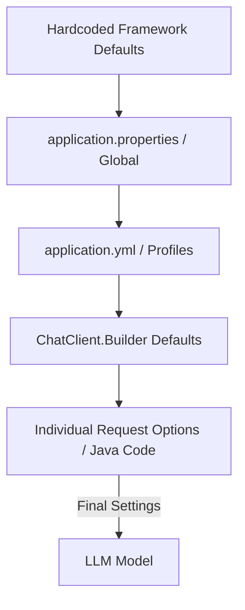

# Topic 10: Prompt Defaults in Spring AI

While you can configure a prompt per-request, setting global defaults in `application.properties` keeps your code clean and ensures a consistent behavior across your entire application.

---

### Real-World Analogy: The Coffee Machine Settings

Imagine you have a high-end coffee machine.
- **Factory Settings (Prompt Defaults)**: By default, the water is at 90°C and it uses "Normal" strength coffee. You don't have to tell the machine this every morning (**Global Configuration**).
- **Custom Order (Request-level)**: If you feel adventurous one day, you override the machine to "Extra Hot" and "Double Strength" (**Controller-level options**).

---

### Setting Defaults in Spring AI

You can set these options globally for all chat requests in your `application.properties`.

#### 1. Configuration (application.properties)
```properties
# Global Temperature (0.0 to 1.0)
spring.ai.google.genai.chat.options.temperature=0.4

# Max Tokens (Cost Control)
spring.ai.google.genai.chat.options.max-tokens=512

# Default System Message (The AI's Global Identity)
# Note: Some providers use specific system message properties or you can inject it via ChatClient.Builder
```

#### 2. Overriding in Java
If you need something different for a specific endpoint, your Java code **takes priority** over the properties file.
```java
return chatClient.prompt()
        .user(message)
        .options(GoogleGeneratorChatOptions.builder()
            .withTemperature(0.9f) // THIS overrides the 0.4 from properties!
            .build())
        .call()
        .content();
```

---

### Flow Diagram: Configuration Priority



---

### Why use Prompt Defaults?
- **Security**: Set a low `max-tokens` limit globally to avoid massive API bills if an error occurs.
- **Consistency**: Ensure all your bots have the same "Creative Level" if you're building a specialized app.
- **Cleaner Code**: No need to clutter your controllers with the same `ChatOptions` every time.

---

### Summary
Think of `application.properties` as your **Safety Net** and **Guideline**. It defines the rules of the house, while your controllers handle the specific interactions.
