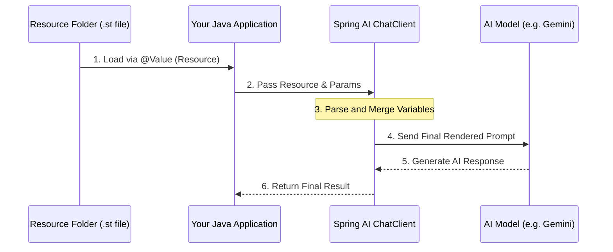

# Topic 12: Mastering Prompt Templating

As your prompts grow into hundreds of lines (for complex logic or reasoning), keeping them as strings inside Java code makes your project messy. Mastering prompt templating means **Externalizing** your prompts into files and managing them like and other resource.

---

### Real-World Analogy: The Restaurant's Menu Board

Imagine a busy restaurant.
- **Code Hardcoding (The Mess)**: The chef has to write every dish's name on a piece of paper for every single customer manually.
- **Externalized Templates (The Master)**: The chef has a **Printed Menu** (Prompt File) on the wall. They just point to it and ask the waiter to "Inject" the customer's choice. When they change the price or add a dish, they update the menu once, and the rest of the restaurant is automatically updated.

---

### Key Techniques for Mastering Prompts

#### 1. Externalizing Prompts (The .st or .txt files)
Don't put a 500-word system prompt inside a Java string. Put it in `src/main/resources/prompts/my-prompt.st`.
- **How it works**: Use the `@Value` annotation to load the prompt file as a resource.

#### 2. Multiple Input Variables
A master prompt might take many inputs, like a user's name, their last 3 orders, and a specific discount code.
- **Example**: `PromptTemplate(resource).create(Map.of("user", "Alice", "order_history", List.of("Pizza", "Soda"), "discount", "SAVE10"))`.

---

### Implementation Example (External Files)

#### 1. Create a Prompt File (`src/main/resources/prompts/expert-advice.st`)
```text
You are a senior {expertise} consultant.
A client has asked for advice on: {issue}.
Provide a {tone} analysis with 3 actionable steps.
```

#### 2. Load and Use in Java
```java
@Value("classpath:/prompts/expert-advice.st")
private Resource expertPromptResource;

@GetMapping("/expert-advice")
public String getAdvice(@RequestParam String issue) {
    PromptTemplate template = new PromptTemplate(expertPromptResource);
    return chatClient.prompt(template.create(Map.of(
            "expertise", "Java Architecture",
            "issue", issue,
            "tone", "highly professional"
    ))).call().content();
}
```

---

### Flow Diagram: The External Prompt Lifecycle



---

### Why Master Externalized Prompts?
- **Separation of Concerns**: Your Java code handles data/logic; your prompt files handle the AI personality and instructions.
- **Non-Developer Editing**: A "Prompt Engineer" or a Non-Dev can edit the `.st` files without needing to understand or recompile the Java code.
- **Easier Versioning**: You can track changes to your prompts in Git separately from your code logic.

---

### How to Test
Experience expert advice loaded from an external `.st` resource file:
```bash
# Get professional advice on any Java/Spring issue
curl "http://localhost:8080/topic-12/expert-advice?issue=How+to+handle+circular+dependencies?"
```

---

### Summary
Mastering prompt templating is the difference between a prototype and a **Production-Ready AI Application**. It ensures your code is scalable, maintainable, and flexible enough to handle the most complex AI challenges.
