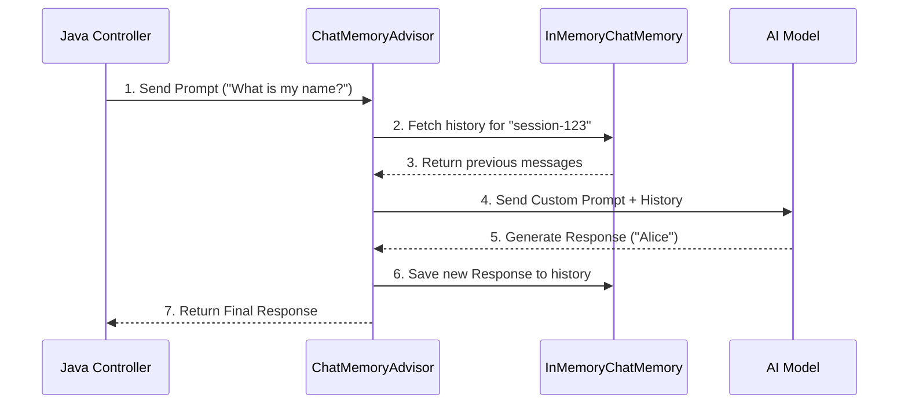

# Topic 14: Advisors in Spring AI

Advisors in Spring AI are the equivalent of "Interceptors" in traditional Spring Web applications. They allow you to intercept the prompt before it is sent to the LLM and intercept the response before it is returned to your application.

---

### Real-World Analogy: The Executive Assistant

Imagine you are a busy CEO (The Application) talking to a brilliant but forgetful Subject Matter Expert (The LLM).
- You hire an **Executive Assistant (Advisor)**.
- Before you send a question to the Expert, the Assistant attaches a folder of all your previous conversations (**Chat Memory Advisor**).
- When the Expert replies, the Assistant logs how long it took and files the new answer into the folder before handing it to you.

---

### Key Advisor: Chat Memory

LLMs are fundamentally stateless. If you ask "What is my name?" after telling it your name, the LLM will not know. Spring AI solves this using `MessageChatMemoryAdvisor`.

#### 1. The Components
- `ChatMemory`: The storage mechanism (e.g., `InMemoryChatMemory`, `RedisChatMemory`).
- `MessageChatMemoryAdvisor`: The interceptor that retrieves history from `ChatMemory`, appends it to the outgoing prompt, and saves the new response.

---

### Implementation Example (Chat Memory)

```java
// 1. Define a global memory store
ChatMemory chatMemory = new InMemoryChatMemory();

// 2. Use the Advisor in your ChatClient
String response = chatClient.prompt()
    .user("My name is Alice.")
    .advisors(new MessageChatMemoryAdvisor(chatMemory, "conversation-123", 10)) 
    .call()
    .content();
```
*Note: `"conversation-123"` is the unique Chat ID for the specific user/session, and `10` restricts the memory to the last 10 messages.*

---

### Flow Diagram: How Advisors Work



---

### Summary
Advisors are the primary mechanism for extending and adding state to the `ChatClient`. By utilizing Chat Memory Advisors, you can easily build robust conversational bots without manually managing history logic.
