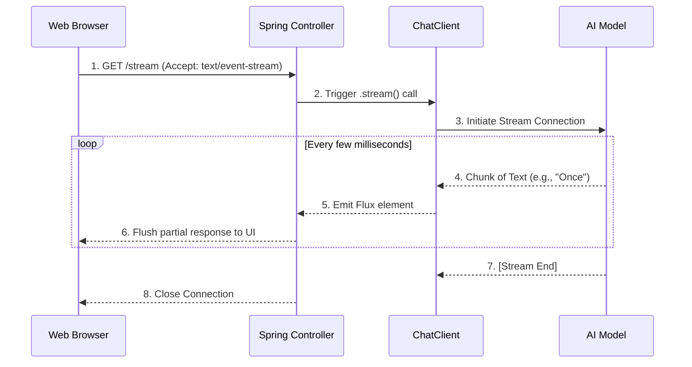

# Topic 16: Streaming Responses in Spring AI

When an AI model generates a long response (e.g., writing an essay), it can take 10-30 seconds. In a traditional HTTP request, the user stares at a loading spinner until the entire response is complete. **Streaming** solves this by sending chunks of text back to the client as soon as they are generated.

---

### Real-World Analogy: The Typewriter vs. The Printer

- **Traditional Blocking Call (The Printer)**: You wait 20 seconds while the entire page is processed inside the machine. You only get to read it when the full page spits out at the very end.
- **Streaming Call (The Typewriter)**: You see the text appearing on the page letter-by-letter as it is being typed. You can start reading immediately, drastically reducing perceived latency.

---

### Key Components

#### 1. Reactor Core (`Flux<T>`)
Spring AI leverages Project Reactor. A `Flux<String>` is a Reactive stream that emits zero to many string items over time, and eventually completes.

#### 2. Server-Sent Events (SSE)
To stream the `Flux` to a web client (like a React or Angular frontend), Spring WebMvc dynamically converts the stream into an `application/x-ndjson` or `text/event-stream` HTTP response.

---

### Implementation Example (Streaming)

```java
@GetMapping(value = "/stream", produces = MediaType.TEXT_EVENT_STREAM_VALUE)
public Flux<String> streamStory(@RequestParam String topic) {
    return chatClient.prompt()
            .user("Write a very long story about: " + topic)
            .stream()       // Activates Reactive Streaming instead of .call()
            .content();     // Returns Flux<String>
}
```

---

### Flow Diagram: Streaming Lifecycle



---

### How to Test

Using `curl`, you can simulate a streaming client. Notice the output arriving in chunks instead of all at once:

```bash
# The -N flag disables curl's local buffering so you see the stream live
curl -N "http://localhost:8080/topic-16/stream?topic=Space"
```

---

### Summary
Streaming is a non-negotiable feature for production AI applications involving long-form generation. By switching `.call()` to `.stream()`, you drastically improve perceived performance and user experience.
