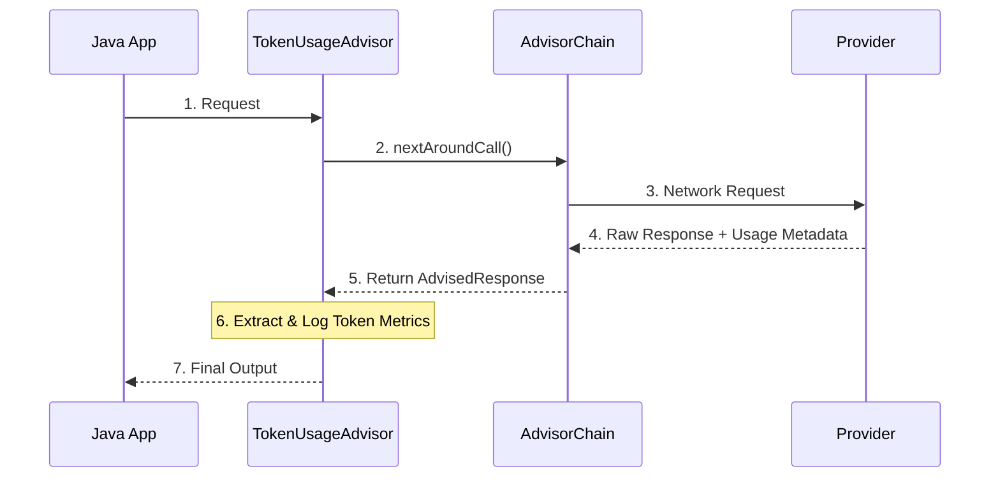

# Topic 15: Custom Advisors & Token Usage

While Spring AI provides built-in advisors for Memory and Logging, you will often need to write custom interceptors for auditing, prompt manipulation, or cost tracking.

---

### Real-World Analogy: The Toll Booth

Imagine a highway (the request flow) leading to a specific city (the LLM).
- **The Toll Booth (Custom Advisor)** sits on the highway.
- As cars (requests) pass, the toll booth inspects them, perhaps adding a tracking sticker.
- When cars return (responses), the toll booth checks the receipt (metadata) to calculate exactly how much the trip cost (Tokens) and logs it for accounting.

---

### Understanding the `CallAroundAdvisor` Interface

To create a custom interceptor, you implement the `CallAroundAdvisor` (for standard calls) or `StreamAroundAdvisor` (for reactive streams).

#### The Interface Method
```java
@Override
public AdvisedResponse aroundCall(AdvisedRequest advisedRequest, CallAroundAdvisorChain chain) {
    // 1. PRE-PROCESSING (Before hitting the LLM)
    // Modify the advisedRequest here (e.g. SafeGuard checks)
    
    // 2. EXECUTE CALL
    AdvisedResponse response = chain.nextAroundCall(advisedRequest);
    
    // 3. POST-PROCESSING (After hitting the LLM)
    // Inspect or modify the response here (e.g. read Token Usage)
    
    return response;
}
```

---

### Implementation Example: Token Usage Advisor

A common requirement is tracking how many tokens a specific user consumed to calculate billing or apply rate limits.

```java
public class TokenUsageAdvisor implements CallAroundAdvisor {
    
    @Override
    public String getName() { return "TokenUsageAdvisor"; }
    
    @Override
    public int getOrder() { return 0; }

    @Override
    public AdvisedResponse aroundCall(AdvisedRequest advisedRequest, CallAroundAdvisorChain chain) {
        
        // Proceed with the LLM Call
        AdvisedResponse advisedResponse = chain.nextAroundCall(advisedRequest);
        
        // Extract Metadata from the response
        ChatResponse chatResponse = advisedResponse.response();
        if (chatResponse != null && chatResponse.getMetadata() != null) {
            Usage usage = chatResponse.getMetadata().getUsage();
            System.out.println("Tokens Consumed - Prompt: " + usage.getPromptTokens() + 
                               ", Generation: " + usage.getGenerationTokens());
        }
        
        return advisedResponse;
    }
}
```

---

### Flow Diagram: Custom Advisor Interception



---

### Summary
Custom Advisors provide the ultimate flexibility. Whether you are building a strict `SafeGuardAdvisor` to block profanity or enforce prompt injection checks, or a `TokenUsageAdvisor` for billing, interceptors ensure your AI integration remains auditable and secure.
