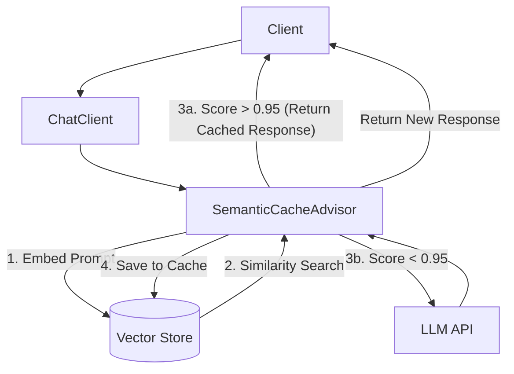

# Topic 15: Semantic Caching

## Overview
Traditional caching solutions save responses based on exact key matches. In AI applications, users rarely type the exact same prompt twice. **Semantic Caching** solves this by converting prompts into vector embeddings and looking for "semantically similar" past queries, significantly reducing latency and API costs.

## Real-World Analogy
Imagine a librarian. Yesterday, someone asked "Where can I find books on cooking pasta?" He spent 10 minutes finding the Italian section. Today, you ask "Do you have guides for boiling spaghetti?". Instead of searching the library again, the librarian thinks *"That's basically the same question"* and instantly sends you to the Italian section.

## Architecture Flow


## Concepts
1. **Embedding-Based Lookup**: Incoming prompts are embedded and searched against a Vector Store instead of a Redis Key-Value store.
2. **Thresholding**: If the similarity score of a previous prompt is > 0.95 (or a configured threshold), the cached LLM response is returned immediately.
3. **Cost Reduction**: Avoids sending identical intents to OpenAI/Gemini, effectively cutting down your API bill.

## Implementing Semantic Caching in Spring AI
Spring AI allows you to inject caching directly into your `ChatClient` using an `Advisor`.

```java
@Bean
public ChatClient chatClient(ChatClient.Builder builder, VectorStore vectorStore) {
    return builder
        .defaultAdvisors(new SemanticCacheAdvisor(vectorStore, 0.95)) // Hypothetical or Custom Advisor implementation
        .build();
}
```

*Note: While Spring AI memory advisors exist, if `SemanticCacheAdvisor` isn't natively available in your version, it can be implemented as a custom `CallAroundAdvisor` that intercepts requests, checks the `VectorStore`, and returns the cached result if similarity is high.*
