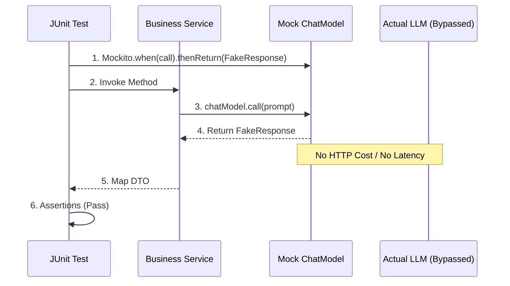

# Topic 16: Mocking AI in Unit Tests

## Overview
Testing AI applications can be slow, flaky, and expensive if every JUnit test hits the actual OpenAI or Gemini APIs. To ensure deterministic CI/CD pipelines, we must mock AI responses.

## Real-World Analogy
Imagine running a fire drill in an office. Instead of lighting a real fire (which is expensive, dangerous, and unpredictable), you pull a fire alarm switch that artificially triggers the sirens. Mocking AI is like the fake fire drill—you test how your system reacts to an emergency (or an AI response) without paying the cost of querying a real LLM.

## Architecture Flow


## Concepts
1. **Avoid API Costs**: Never run real models in your standard test suite.
2. **Deterministic Output**: LLMs are unpredictable. Mocking guarantees you receive the exact JSON or string required to test your downstream logic.
3. **Testing Resilience**: Mocks allow you to simulate Rate Limits (`429`), timeouts, or malformed JSON to test how your application recovers.

## Implementation Guide
You can mock the `ChatModel` interface easily using Mockito, or use Spring AI's provided testing utilities if available.

```java
import org.junit.jupiter.api.Test;
import static org.mockito.Mockito.*;
import org.springframework.ai.chat.model.ChatModel;
import org.springframework.ai.chat.model.ChatResponse;
import org.springframework.ai.chat.model.Generation;
import org.springframework.ai.chat.prompt.Prompt;
// ...

@Test
void testAiResponseParsing() {
    // 1. Mock the specific ChatModel
    ChatModel mockModel = mock(ChatModel.class);
    
    // 2. Prepare fake response
    Generation mockGen = new Generation("{\"score\": 95}");
    ChatResponse mockResponse = new ChatResponse(List.of(mockGen));
    
    // 3. Stub the prompt call
    when(mockModel.call(any(Prompt.class))).thenReturn(mockResponse);
    
    // 4. Test your logic
    MyService service = new MyService(mockModel);
    int score = service.evaluateCandidate("resume text");
    assertEquals(95, score);
}
```
