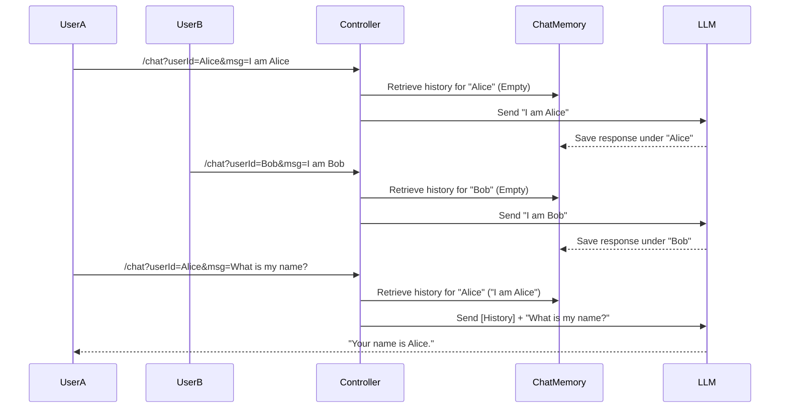

# Topic 19: Managing Multiple User Sessions

If you build a chatbot, you usually have more than one user. If you use a hardcoded conversation ID (like we did in the previous topic), **User A**'s chat history will be merged with **User B**'s chat history. The AI will start answering User A based on what User B asked five minutes ago!

---

### Real-World Analogy: The Switchboard Operator

Imagine a switchboard operator at a telephone company.
- When John calls, the operator connects him to Line 1.
- When Mary calls, the operator connects her to Line 2.
- The operator (Spring Boot) must strictly isolate these lines. If the lines cross, John hears Mary's conversation.

In Spring AI, the "Line" is the **Conversation ID**.

---

### Implementation: Dynamic Conversation IDs

To manage multiple users, the `Conversation ID` must be dynamically evaluated per request, rather than hardcoded during the initial `ChatClient.Builder` setup.

#### Approach
Instead of passing a static string into `MessageChatMemoryAdvisor`, we provide it as a parameter during the request execution.

```java
import org.springframework.ai.chat.client.ChatClient;
import org.springframework.ai.chat.client.advisor.MessageChatMemoryAdvisor;
import org.springframework.ai.chat.memory.ChatMemory;
import org.springframework.web.bind.annotation.*;

@RestController
@RequestMapping("/topic-19")
public class MultiSessionController {

    private final ChatClient chatClient;
    private final ChatMemory chatMemory;

    public MultiSessionController(ChatClient.Builder builder, ChatMemory chatMemory) {
        this.chatMemory = chatMemory;
        
        // We configure the Advisor globally, but leave the Conversation ID dynamic
        this.chatClient = builder
                .defaultAdvisors(new MessageChatMemoryAdvisor(chatMemory))
                .build();
    }

    @GetMapping("/chat")
    public String chat(@RequestParam String userId, @RequestParam String message) {
        
        return chatClient.prompt()
                .user(message)
                // Overriding the advisor parameter for this specific execution
                .advisors(a -> a.param(MessageChatMemoryAdvisor.CHAT_MEMORY_CONVERSATION_ID_KEY, userId)
                                .param(MessageChatMemoryAdvisor.CHAT_MEMORY_RETRIEVE_SIZE_KEY, 10))
                .call()
                .content();
    }
}
```

---

### Flow Diagram: Multi-User Chat Memory



---

### Summary
To support multiple concurrent users, you must isolate their conversation contexts. By passing a unique `userId` (often derived from a JWT token or Session ID in a real application) to the `CHAT_MEMORY_CONVERSATION_ID_KEY`, Spring AI ensures complete isolation bridging the gap between stateless LLMs and multi-tenant applications.
