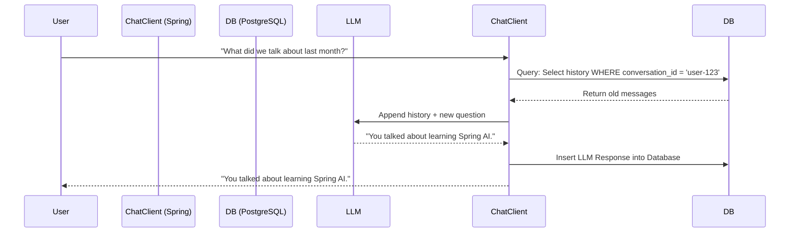

# Topic 20: Persistent Chat Conversations (`JdbcChatMemoryRepository`)

`InMemoryChatMemory` is excellent for testing, but it is deleted the moment your Spring Boot application stops or crashes. To remember things forever (or at least reliably across server restarts), you need a persistent `ChatMemory` implementation.

---

### Real-World Analogy: The Filing Cabinet

- **InMemoryChatMemory** is like the receptionist keeping notes on a whiteboard. It is fast, but the janitor (server restart) erases it every night.
- **Persistent Chat Memory** is the receptionist immediately storing all notes in a locked, fireproof **Filing Cabinet** (Database). Tomorrow, even if it's a completely different receptionist (a different server instance), they can just open the cabinet, lookup Bob's file, and pick up the conversation exactly where it left off.

---

### Integrating `JdbcChatMemoryRepository`

Spring AI officially supports `pgvector` (PostgreSQL) and other data stores, but for conversation history, you can use a generic relational database interface. 

*(Note: Spring AI provides specific modules for this. `JdbcChatMemory` relies on standard `JdbcTemplate` to read/write from a relational database).*

#### 1. The Database Schema
You generally need a table designed to hold conversation threads. A basic schema (which Spring AI automates or requires you to define) looks like:

```sql
CREATE TABLE VECTOR_STORE (
    id UUID DEFAULT uuid_generate_v4() PRIMARY KEY,
    content TEXT,
    metadata JSONB,
    embedding VECTOR(768)
);
```
*Note: While `VectorStore` is often used for RAG, simple Chat Memory can either reuse a Vector repository or a standard RDBMS table mapping `conversation_id`, `role` (user/assistant), and `content`.*

#### 2. Configuration Example
Instead of returning `InMemoryChatMemory`, you return the `Jdbc` backed equivalent.

```java
import org.springframework.context.annotation.Bean;
import org.springframework.context.annotation.Configuration;
import org.springframework.jdbc.core.JdbcTemplate;
// Hypothetical package for JdbcChatMemory in specific spring-ai modules/extensions
// import org.springframework.ai.chat.memory.jdbc.JdbcChatMemory; 

@Configuration
public class PersistentMemoryConfig {

    @Bean
    public ChatMemory persistentChatMemory(JdbcTemplate jdbcTemplate) {
        // Initializes connection to your SQL Database and maps history
        // return new JdbcChatMemory(jdbcTemplate); 
        
        // *If using Vector Stores for memory:
        // return new VectorStoreChatMemoryAdvisor(vectorStore, ...);
        return null; // Implementation depends on specific Spring AI persistence module
    }
}
```

---

### Flow Diagram: Persistent Chat Memory



---

### Summary
For strict production requirements where context cannot be lost (e.g., customer support bots, therapy apps), you must swap `InMemoryChatMemory` for a database-backed alternative. Spring AI abstracts this beautifully: the `MessageChatMemoryAdvisor` in your controller never changes, only the underlying `@Bean` definition does.
