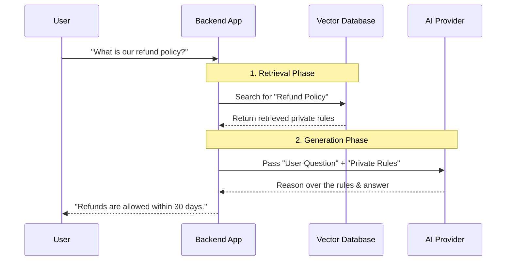

# Topic 21: Everything you need to know about RAG

RAG stands for **Retrieval-Augmented Generation**. It is the most critical pattern in modern AI application development, enabling LLMs to answer questions about private, proprietary, or highly recent data.

---

### Real-World Analogy: The Open-Book Exam

Imagine an incredibly smart student taking an exam.
- **Without RAG (Closed Book)**: The student relies solely on what they memorized during their studies months ago. If you ask them a highly specific question about a company's internal rules, they will likely guess (hallucinate) because they never studied it.
- **With RAG (Open Book)**: The student is handed a library of your specific company documents right before the exam. Instead of guessing, they *retrieve* the rulebook, read the relevant section, and *generate* a perfect answer.

---

### Why Do We Need RAG?

LLMs (like GPT-4 or Gemini) have three major limitations:
1.  **Stuck in the Past**: They are trained on a static snapshot of the internet. If you ask about yesterday's news, they won't know.
2.  **No Private Data**: They have no access to your corporate Confluence pages, JIRA tickets, or user databases.
3.  **Hallucinations**: When an LLM doesn't know the answer, it tends to confidently make one up.

RAG solves all three by providing the AI with the exact factual context it needs *at the exact moment* you ask the question.

---

### How RAG Works (High-Level)

RAG is a two-step dance:

1.  **Retrieval Phase (The Search Engine)**:
    - User asks: "What is our company's refund policy?"
    - Your backend searches your private database and retrieves a PDF paragraph that says: "Refunds are allowed within 30 days."
2.  **Generation Phase (The LLM)**:
    - Your backend combines the retrieved paragraph with the user's question.
    - You send this to the LLM: *"Based on the following rule [Refunds are allowed within 30 days], answer the user's question: What is our refund policy?"*
    - The LLM answers accurately.

---

### Flow Diagram: The RAG Lifecycle

---

### Summary
RAG prevents hallucinations and enables intelligent chat over private data. However, the hardest part of RAG isn't the AI—it is the **Retrieval** phase. Traditional keyword search (SQL `LIKE '%refund%'`) is often not smart enough for conversational AI. To do retrieval properly, we need a mathematical concept called **Vectors**, which we cover in the next topic.
