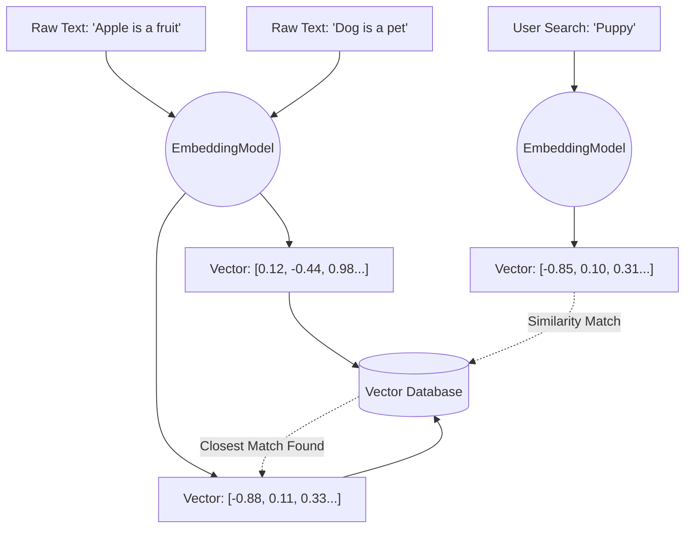

# Topic 22: Vectors, Embeddings, and Vector Databases

To perform the "Retrieval" step of RAG effectively, we cannot rely on traditional keyword searches. If a user searches for "automobile," a SQL database looking for "car" will return zero results. AI searches by *meaning*, not by keywords.

---

### Real-World Analogy: The Library Coordinate System

Imagine a massive library where books are organized not alphabetically, but by concepts on a 3-dimensional map.
- Books about "Dogs" are placed at coordinates `[10, 5, 2]`.
- Books about "Wolves" are placed right next to them at `[9, 5, 2]`.
- Books about "Apples" are placed far away in the fruit aisle at `[-15, -10, 8]`.

If you search for "Puppy," the librarian translates "Puppy" into coordinates `[9.5, 4.8, 2.1]` and simply grabs the books physically closest to that spot—finding "Dogs" and "Wolves" effortlessly, even if the word "Puppy" isn't in the title.

---

### 1. What is an Embedding?

An **Embedding** is the process of taking a piece of text (a word, a sentence, or a document) and translating it into a massive array of floating-point numbers (a Vector). 

In Spring AI, this is handled by an `EmbeddingModel` (e.g., OpenAI's `text-embedding-3-small` or Google's Vertex Equivalents).

### 2. What is a Vector?

A **Vector** is simply the array of numbers returned by the `EmbeddingModel`. Example: `[0.12, -0.45, 0.89, ...]`
- The model translates semantic meaning into mathematical dimensions.
- Vectors usually have hundreds or thousands of dimensions (e.g., 1536 dimensions).

### 3. What is a Vector Database?

A **Vector Database** (like PGVector, Chroma, or Milvus) is a database optimized for calculating the mathematical distance between vectors. 
- It stores the original text alongside its Vector embedding.
- When you provide a query Vector, the database calculating which stored Vectors are closest in the multi-dimensional space, returning the most semantically related documents.

---

### Implementation in Spring AI

Spring AI provides a unified `EmbeddingModel` interface to generate vectors, and a `VectorStore` interface to abstract away the underlying database.

```java
// Generating an embedding array from text
float[] vector = embeddingModel.embed("What is the refund policy?");
System.out.println("Dimensions: " + vector.length);
```

---

### Flow Diagram: Understanding Embeddings



---

### Summary
Embeddings translate human meaning into mathematical coordinates (Vectors). Vector Databases store these coordinates and excel at finding which texts are "closest" in meaning to your search query. This forms the absolute foundation of the RAG retrieval phase.
