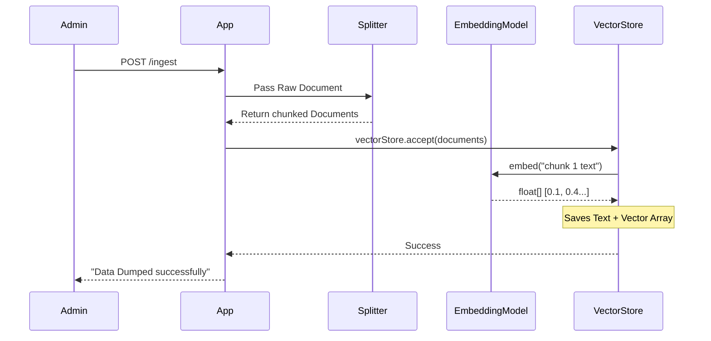

# Topic 23: Setup Vector Database & Dump Embeddings

Retrieval-Augmented Generation (RAG) relies on building a library of knowledge. In Spring AI, building this library involves reading documents, converting them to Vectors (Embeddings), and saving them to a **Vector Store**.

---

### Real-World Analogy: Creating the Library Index

Imagine receiving 10,000 pages of unstructured corporate documents.
1. **Reading**: You read the documents (`DocumentReader`).
2. **Splitting**: You cut the pages into smaller, single-topic paragraphs so you don't overwhelm the search engine (`TokenTextSplitter`).
3. **Embedding**: You translate the meaning of each paragraph into mathematical coordinates (`EmbeddingModel`).
4. **Storing**: You save the text and its coordinates into a highly organized index catalog (`VectorStore`).

---

### Step 1: Setting up a Vector Store

Spring AI supports many Vector Databases (PGVector, Redis, Chroma, Milvus, etc.). For development and testing, you can use the `SimpleVectorStore`, which stores vectors in-memory (and can optionally save/load from a JSON file).

```java
import org.springframework.ai.embedding.EmbeddingModel;
import org.springframework.ai.vectorstore.SimpleVectorStore;
import org.springframework.ai.vectorstore.VectorStore;
import org.springframework.context.annotation.Bean;
import org.springframework.context.annotation.Configuration;

@Configuration
public class VectorStoreConfig {

    @Bean
    public VectorStore vectorStore(EmbeddingModel embeddingModel) {
        // The SimpleVectorStore requires an EmbeddingModel to calculate 
        // the dimensions of the text it's storing.
        return new SimpleVectorStore(embeddingModel);
    }
}
```

---

### Step 2: Ingesting Documents (Dumping Embeddings)

Once the `VectorStore` is configured, you must populate it. This is usually done in an initialization step or via an admin API.

```java
import org.springframework.ai.document.Document;
import org.springframework.ai.transformer.splitter.TokenTextSplitter;
import org.springframework.ai.vectorstore.VectorStore;
import org.springframework.web.bind.annotation.PostMapping;
import org.springframework.web.bind.annotation.RestController;

import java.util.List;

@RestController
public class IngestionController {

    private final VectorStore vectorStore;

    public IngestionController(VectorStore vectorStore) {
        this.vectorStore = vectorStore;
    }

    @PostMapping("/topic-23/ingest")
    public String ingestData() {
        // 1. Create a raw document (Usually read from PDF/Text file via DocumentReader)
        Document rawDocumentation = new Document("Spring AI makes building AI apps easy. " +
                "It provides ChatClient for LLM access. It provides VectorStore for RAG.");

        // 2. Split the large document into smaller chunks
        // Why? Because LLMs have context limits, and smaller chunks yield better search accuracy.
        TokenTextSplitter splitter = new TokenTextSplitter();
        List<Document> splitDocuments = splitter.apply(List.of(rawDocumentation));

        // 3. Write to the Vector Database
        // Under the hood, this calls the EmbeddingModel to convert text -> Vectors, 
        // then saves both the geometry and the text.
        vectorStore.accept(splitDocuments);

        return "Data successfully embedded and dumped into the Vector DB!";
    }
}
```

---

### Flow Diagram: Data Ingestion



---

### Summary
Populating a Vector Database is pure data engineering. It happens asynchronously from the user's Chat requests. By reading, splitting, embedding, and storing your private data, you create the "Open Book" the LLM will consult during the RAG process.
