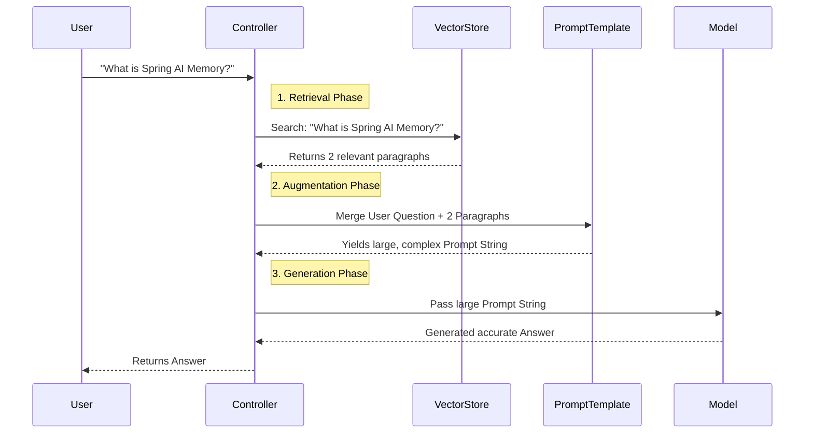

# Topic 24: Similarity Search & Manual LLM Passing

Once our Vector Database is filled with private documents, we need to extract the relevant pieces of information when a user asks a question, and pass that data to the LLM. Doing this "manually" helps you understand exactly how RAG works under the hood.

---

### Real-World Analogy: The Research Assistant

1. **The User** asks: *"What are the tax implications of remote work?"*
2. **The Research Assistant (Similarity Search)** rushes to the library (Vector Store), skips all books about cooking, finds the exact 3 paragraphs regarding taxes and remote work, and photocopies them.
3. **You (The Prompt template)** staple the photocopied paragraphs to the user's question and slide the entire packet under the door to the **Expert (The LLM)** to write the final memo.

---

### Step 1: Performing Similarity Search

The `VectorStore` interface provides a method to search for documents that are mathematically "similar" to a user's query.

```java
import org.springframework.ai.document.Document;
import org.springframework.ai.vectorstore.SearchRequest;
import org.springframework.ai.vectorstore.VectorStore;

// ...

String userQuery = "How does Spring AI handle Memory?";

// Search the vector database for the top 2 closest documents
List<Document> similarDocuments = vectorStore.similaritySearch(
    SearchRequest.query(userQuery).withTopK(2)
);

// Combine the retrieved documents into a single massive String
String retrievedContext = similarDocuments.stream()
    .map(Document::getContent)
    .collect(Collectors.joining(System.lineSeparator()));
```

---

### Step 2: Passing Context Manually to the LLM

Now that we have the `retrievedContext`, we must inject it into a `PromptTemplate` so the LLM understands it is supposed to use this external data to answer the question.

```java
import org.springframework.ai.chat.client.ChatClient;
import org.springframework.ai.chat.prompt.PromptTemplate;
import org.springframework.web.bind.annotation.*;
import java.util.Map;

@RestController
@RequestMapping("/topic-24")
public class ManualRagController {

    private final ChatClient chatClient;
    private final VectorStore vectorStore;

    // A prompt explicitly instructing the LLM to use the provided context
    private final String ragPrompt = """
            You are a helpful assistant. Ensure your answers are based ONLY on the provided context.
            If the context does not contain the answer, say "I don't know."
            
            Context:
            {context}
            
            User Question:
            {question}
            """;

    public ManualRagController(ChatClient.Builder builder, VectorStore vectorStore) {
        this.chatClient = builder.build();
        this.vectorStore = vectorStore;
    }

    @GetMapping("/ask")
    public String ask(@RequestParam String question) {
        // 1. Similarity Search
        String context = vectorStore.similaritySearch(SearchRequest.query(question).withTopK(2))
                .stream()
                .map(Document::getContent)
                .collect(Collectors.joining("\n"));

        // 2. Format the Prompt Template manually
        PromptTemplate template = new PromptTemplate(ragPrompt);
        String finalPrompt = template.render(Map.of(
                "context", context,
                "question", question
        ));

        // 3. Call the LLM
        return chatClient.prompt()
                .user(finalPrompt)
                .call()
                .content();
    }
}
```

---

### Flow Diagram: Manual RAG Execution



---

### Summary
Manual RAG is empowering because it removes the "magic" from AI. You are explicitly calculating similarities, building a large prompt string, and forcing the LLM to restrict its answers to the context you provided. While highly educational, doing this manually for every endpoint is tedious. In the next topic, we look at how Spring AI automates this exact process.
