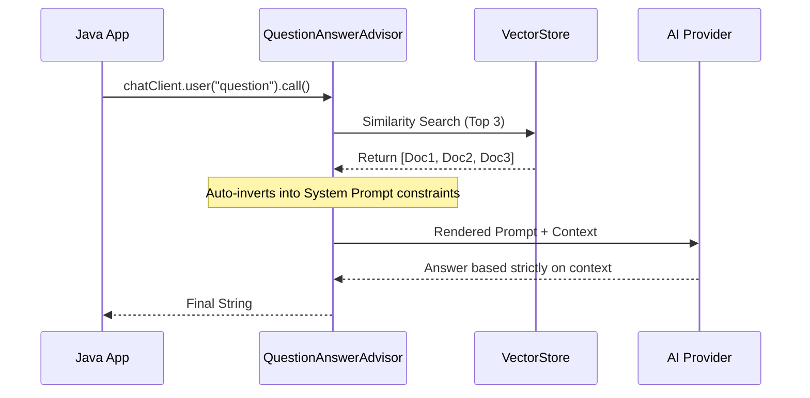

# Topic 25: Automatic RAG with QuestionAnswerAdvisor

In the previous topic, we saw how tedious Manual RAG is: performing similarity searches, wrangling Document objects into a massive string, building a PromptTemplate, and finally calling the LLM. 

Spring AI completely automates this boilerplate with the **`QuestionAnswerAdvisor`**.

---

### Real-World Analogy: The "Done For You" Service

Instead of you manually running to the library to fetch photocopies (Manual RAG), you hire a premium Full-Service Assistant (the `QuestionAnswerAdvisor`). 
When the user asks a question, the Assistant *automatically* goes to the library, pulls the relevant context, merges it with the question seamlessly, and gets the final answer—all in one step.

---

### Implementation: The Automatic Way

To implement Automatic RAG, you simply attach the `QuestionAnswerAdvisor` to your `ChatClient` builder. You provide it with the `VectorStore` you want to search against.

#### Before (Manual RAG)
```java
// 10 lines of code doing similarity search, streams, mapping, 
// PromptTemplate rendering, and finally chatClient.call()
```

#### After (Automatic RAG)
```java
import org.springframework.ai.chat.client.ChatClient;
import org.springframework.ai.chat.client.advisor.QuestionAnswerAdvisor;
import org.springframework.ai.vectorstore.SearchRequest;
import org.springframework.ai.vectorstore.VectorStore;
import org.springframework.web.bind.annotation.*;

@RestController
@RequestMapping("/topic-25")
public class AutomaticRagController {

    private final ChatClient chatClient;

    public AutomaticRagController(ChatClient.Builder builder, VectorStore vectorStore) {
        // We configure the LLM to *always* consult the VectorStore before answering
        this.chatClient = builder
                .defaultAdvisors(
                    new QuestionAnswerAdvisor(
                        vectorStore, 
                        // You can customize the search parameters, e.g., Top 3 results
                        SearchRequest.defaults().withTopK(3)
                    )
                )
                .build();
    }

    @GetMapping("/ask")
    public String ask(@RequestParam String question) {
        // Look how clean this is!
        return chatClient.prompt()
                .user(question)
                .call()
                .content();
    }
}
```

---

### Under the Hood: How Spring AI Magic Works

When you call `.call()` on an advised `ChatClient`, here is what silently happens:
1. **Interception**: The `QuestionAnswerAdvisor` catches the user's prompt `"What is Spring AI?"`.
2. **Retrieval**: It runs `vectorStore.similaritySearch("What is Spring AI?")`.
3. **Augmentation**: It takes the built-in system prompt template (which looks very similar to our Manual RAG template) and injects the retrieved documents into it.
4. **Execution**: It sends the massive combined payload to the AI provider.

### What is "Prompt Stuffing"?

"Prompt Stuffing" is the industry term for the **Augmentation** phase of RAG. It literally means taking the raw text of the documents you retrieved from the database and "stuffing" them into the prompt you send to the LLM.

When you use the `QuestionAnswerAdvisor`, it intercepts your prompt and uses a hidden System Prompt Template that looks like this:

> *"Context information is below."*
> *"---------------------"*
> *"{question_answer_context}"*
> *"---------------------"*
> *"Given the context and provided history information and not prior knowledge, reply to the user comment. If the answer is not in the context, inform the user that you can't answer the question."*

The Advisor takes the `Document` contents from the similarity search and **stuffs** them into the `{question_answer_context}` variable. 

**⚠️ The Danger of Over-Stuffing:**
LLMs charge by the "Token" and have strict **Context Window Limits** (e.g., 8,000 or 128,000 tokens). If your `TopK` parameter (number of documents to retrieve) is too high, the `QuestionAnswerAdvisor` will stuff too much text into the prompt. This results in:
1. Slower response times (high latency).
2. Huge API bills.
3. Errors if you exceed the model's maximum allowed tokens.

Therefore, formatting small, highly-relevant chunks during the database ingestion phase (Topic 23) is critical so you don't over-stuff the prompt later!

### Flow Diagram: Auto-RAG



---

### Summary
The `QuestionAnswerAdvisor` is the crown jewel of Spring AI's RAG capabilities. By abstracting away the retrieval and prompt-stuffing mechanics, it allows developers to focus on business logic while delivering highly accurate, data-grounded AI responses.
