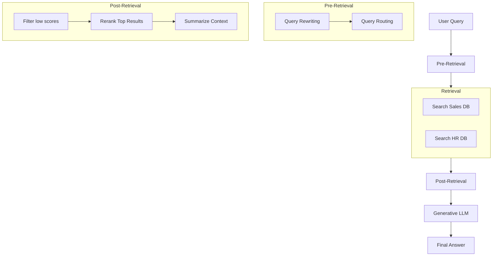

# Topic 26: Advanced RAG Flow

The "Naive RAG" (or Simple RAG) we discussed previously consists of two steps: taking the exact user query, finding the top 3 similar documents via direct vector search, and injecting them into the LLM. 

While Naive RAG works for basic demos, it often fails in production because users ask vague, multi-part, or poorly worded questions that fail to retrieve the right documents mathematically.

This is where **Advanced RAG** comes in.

---

### Real-World Analogy: The Expert Librarian

- **Naive RAG**: You ask the librarian, "I want the book about the green alien." The librarian blindly searches the database for "green alien" and gives you a sci-fi novel, missing the actual book you meant (which was about Yoda).
- **Advanced RAG**: You ask, "I want the book about the green alien." The librarian pauses (**Pre-Retrieval**) and thinks: *They probably mean Star Wars or Yoda*. The librarian checks the database for "Yoda" (**Retrieval**), gets three books, skims them to find the best one (**Post-Retrieval**), and finally hands you the exact correct book.

---

### The Three Pillars of Advanced RAG

#### 1. Pre-Retrieval (Query Manipulation)
Before we ever touch the Vector Database, we use an LLM or logic to fix the user's question.
*   **Query Translation / Rewriting**: Fixing grammar or expanding "it" to the noun they were discussing previously.
*   **Query Routing**: If the user asks for a refund, route the query to the `RefundPolicyVectorStore`. If they ask about vacation days, route to the `HRVectorStore`.
*   **Query Expansion (HyDE)**: Having the LLM generate a *fake* answer to the question first, and running the similarity search on the fake answer instead of the short question.

#### 2. Retrieval
The actual database fetch. Sometimes this involves querying multiple databases simultaneously.

#### 3. Post-Retrieval
After we get 10 documents back from the database, what do we do?
*   **Reranking**: An older/cheaper similarity search might yield decent results, but a specialized Reranker (like Cohere) will mathematically score them again to find the absolute best 2 documents.
*   **Filtering**: Discarding retrieved documents that fall below a certain confidence score threshold.
*   **Compression**: Summarizing the retrieved documents before sending them to the final LLM to save tokens and prevent "Prompt Stuffing" over-saturation.

---

### Flow Diagram: Advanced RAG Pipeline

---

### Summary
Advanced RAG acknowledges that similarity search is imperfect. By sandwiching the Vector Database lookup between intelligent Pre-Retrieval routing and Post-Retrieval filtering, you drastically increase the accuracy and reliability of your AI application.
