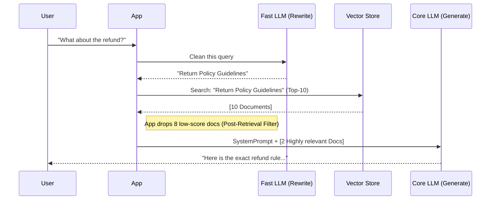

# Topic 27: Implementing RAG Pipeline (Spring AI)

Spring AI provides mechanisms to hook into the Advanced RAG lifecycle without building an entire pipeline engine from scratch. You can implement Pre-Retrieval and Post-Retrieval patterns using a combination of `Advisors`, `FunctionCalling`, and Custom Search implementations.

---

### Layer 1: Query Rewriting (Pre-Retrieval)

Before sending the user's query to the Vector Store, you might want to translate their vague input into an optimized search query. You can do this by using a preliminary LLM call.

```java
// User says: "How do I fix the error from yesterday?"
String unoptimizedQuery = "How do I fix the error from yesterday?";

// Use a fast/cheap LLM call to rewrite the query
String optimizedQuery = chatClient.prompt()
    .system("You are a search query optimizer. Given the user's input, generate a formal, keyword-rich search query suitable for a vector database.")
    .user(unoptimizedQuery)
    .call()
    .content();
    
// Optimized query becomes: "Troubleshooting common network timeout errors April 4th"
```

### Layer 2: Routing via Function Calling (Pre-Retrieval)

If you have multiple databases (e.g., HR Docs vs. Tech Docs), you can use Spring AI's `@Tool` or `FunctionCall` capabilities to act as a Router.

```java
// Spring AI allows LLMs to "choose" a function
// The LLM decides whether to execute searchHrDocuments() or searchTechDocuments() 
// based on the context of the user's question, effectively routing the request.
```

### Layer 3: Custom Search / Reranking (Post-Retrieval)

While Spring AI's `QuestionAnswerAdvisor` handles basic retrieval out of the box, building an advanced pipeline requires manually intercepting the search results to clean or re-rank them.

Instead of passing the basic `vectorStore` to the Advisor, you can implement your own logic:

```java
import org.springframework.ai.document.Document;

public List<Document> advancedRetrieval(String query) {
    // 1. Fetch Top 10 documents
    List<Document> rawResults = vectorStore.similaritySearch(
        SearchRequest.query(query).withTopK(10)
    );
    
    // 2. Filter (Post-Retrieval): Drop things with low similarity
    List<Document> filteredResults = rawResults.stream()
        .filter(doc -> (double) doc.getMetadata().get("similarity_score") > 0.85)
        .toList();
        
    // 3. Rerank / Sort...
    
    return filteredResults;
}
```

### Flow Diagram: Spring AI Advanced Pipeline



---

### Summary
Implementing an advanced RAG pipeline requires moving away from the "one-line" `QuestionAnswerAdvisor` magic and orchestrating the steps manually: rewriting queries, managing multiple Vector Stores, and applying strict filtering to retrieved documents to combat prompt-stuffing limits.
