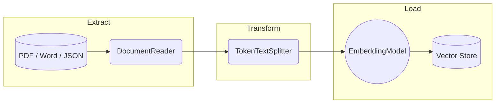

# Topic 28: ETL Pipeline in Detail (Spring AI)

To perform RAG, you need data in your Vector Database. Extracting data from thousands of corporate files and putting it into a database is known as an **ETL Pipeline**.

ETL stands for **Extract, Transform, Load**.

---

### Real-World Analogy: The Juice Factory

1.  **Extract (The Harvest)**: Farmers pick apples, oranges, and carrots from various different farms.
2.  **Transform (The Blender)**: The factory washes the fruit, peels it, cuts it into small, uniform chunks, and extracts the juice.
3.  **Load (The Bottling)**: The juice is poured into standardized bottles and stored securely in the warehouse for later consumption.

---

### 1. Extract (E)

You rarely start with raw text arrays. Your company's data is trapped in unstructured file formats:
- PDFs
- Microsoft Word Documents (.docx)
- JSON files
- Markdown files

**Spring AI Solution**: Document Readers.
Spring AI provides classes like `PagePdfDocumentReader` or `TextReader` that open these files and extract the raw text into a standardized Spring AI `Document` object.

### 2. Transform (T)

You cannot load a 500-page PDF string directly into an LLM or Vector Store.
- **Chunking**: LLMs have token limits. If a search result returns an entire book, the LLM will crash. We must transform (split) the massive document into small, overlapping chunks (e.g., 500 tokens per chunk).
- **Enrichment**: Adding metadata to the chunks, such as `{"author": "John", "date": "2024-04-01"}` so you can filter results later.

**Spring AI Solution**: Document Transformers.
Spring AI provides the `TokenTextSplitter` class to safely slice large documents without breaking sentences in half.

### 3. Load (L)

The transformation yields hundreds of small `Document` chunks. The final step is to calculate their embeddings and save them.

**Spring AI Solution**: The Vector Store.
You use `vectorStore.accept(documents)`. Under the hood, Spring AI calls the `EmbeddingModel` to mathematically embed the chunks, and then inserts both the text and the vectors into Postgres, Redis, or Chroma.

---

### Flow Diagram: The AI ETL Pipeline

---

### Summary
If you do not have a robust ETL pipeline, your RAG application will fail. Poor extraction leads to missing data. Poor transformation (chunking incorrectly) leads to the search engine failing to find relevant context. In the next topic, we will build a real ETL pipeline translating a PDF to a Vector DB.
