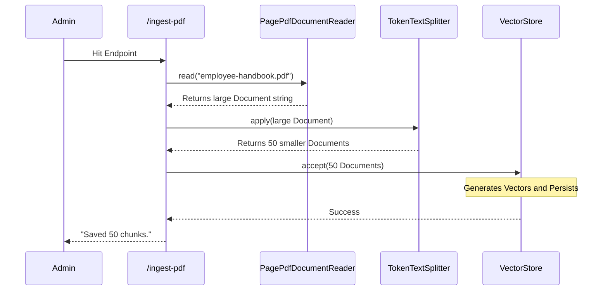

# Topic 29: PDF Text to Vector Database (Full Guide)

In this topic, we will build a complete ETL pipeline that reads a localized PDF file, splits it into digestible chunks, and dumps it into our Vector Database for our QA Advisor to use.

---

### Step-by-Step Implementation

We will create a Spring Rest Controller endpoint that imports a specific PDF when triggered.

#### 1. The Setup

Ensure you have a sample PDF document in your `src/main/resources` folder (e.g., `employee-handbook.pdf`) and the `spring-ai-pdf-document-reader` dependency in your `pom.xml`.

```java
import org.springframework.ai.document.Document;
import org.springframework.ai.reader.pdf.PagePdfDocumentReader;
import org.springframework.ai.transformer.splitter.TokenTextSplitter;
import org.springframework.ai.vectorstore.VectorStore;
import org.springframework.beans.factory.annotation.Value;
import org.springframework.core.io.Resource;
import org.springframework.web.bind.annotation.*;
import java.util.List;

@RestController
@RequestMapping("/topic-29")
public class PdfIngestionController {

    private final VectorStore vectorStore;
    
    // Spring Boot automatically reads files from the resources folder
    @Value("classpath:employee-handbook.pdf")
    private Resource pdfFile;

    public PdfIngestionController(VectorStore vectorStore) {
        this.vectorStore = vectorStore;
    }

    @PostMapping("/ingest-pdf")
    public String ingestPdfData() {
        
        // 1. EXTRACT
        // The PagePdfDocumentReader reads the PDF line by line.
        PagePdfDocumentReader pdfReader = new PagePdfDocumentReader(pdfFile);
        List<Document> rawDocuments = pdfReader.get();

        // 2. TRANSFORM
        // We use the TokenTextSplitter to chunk the PDF into smaller pieces
        // The default chunk size is usually around 800 tokens, with a small overlap
        // to ensure sentences aren't violently cut in half.
        TokenTextSplitter splitter = new TokenTextSplitter();
        List<Document> chunkedDocuments = splitter.apply(rawDocuments);

        // 3. LOAD
        // Send the chunks to the Vector Store (this triggers embedding internally)
        vectorStore.accept(chunkedDocuments);

        return "Successfully read the PDF and saved " + chunkedDocuments.size() + " chunks to the Vector Database.";
    }
}
```

---

### Flow Diagram: Code Execution



---

### Summary
This endpoint demonstrates the exact process required to populate your RAG knowledge base. In production applications, this logic is usually triggered by an event listener (like an AWS S3 bucket upload) rather than a manual REST endpoint, meaning anytime a user uploads a PDF, it is instantly weaponized for AI retrieval!
