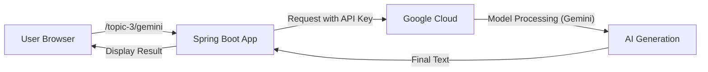

# Topic 3: First AI Project (Google Gemini)

Ready to build? Your first step into Spring AI starts with integrating **Google Gemini**. Let's build a simple **"Text-to-Translation" or "Quote-Generation" service**.

---

### Real-World Analogy: Ordering at Starbucks

Think of Google Gemini as a specialized barista.
- **API Key**: This is your **Loyalty Card** or Credit Card. You need it to order.
- **Prompt**: This is your **Order**. "I'd like a Tall Latte, no foam, with caramel drizzle."
- **ChatModel**: The **Waitress/POS System** that takes your order and delivers it to the Barista (Gemini) and brings the drink back to you.

---

### Integration Steps

#### 1. Prerequisites
You'll need a Google Gemini API Key.
- Sign up at: [aistudio.google.com](https://aistudio.google.com/)
- Create a new API Key.

#### 2. Add Dependencies (`pom.xml`)
We use the official Spring AI Google GenAI starter.
```xml
<dependency>
    <groupId>org.springframework.ai</groupId>
    <artifactId>spring-ai-google-genai</artifactId>
</dependency>
```

#### 3. Configuration (`application.properties`)
Store your API Key here.
```properties
spring.ai.google.genai.api-key=REPLACE_WITH_YOUR_KEY
spring.ai.google.genai.chat.options.model=gemini-1.5-flash
```

#### 4. Writing Code (`ChatController.java`)
Spring AI injects the `ChatModel` (the smart engine) for you!
```java
@RestController
public class AIController {

    private final ChatModel chatModel;

    public AIController(ChatModel chatModel) {
        this.chatModel = chatModel;
    }

    @GetMapping("/topic-3/gemini")
    public String askGemini(@RequestParam(defaultValue = "tell me a joke about Java") String message) {
        return chatModel.call(message);
    }
}
```

---

### Flow Diagram: The Gemini Workflow



---

### Core Components Explained

- **`ChatModel`**: The main interface you interact with. It manages everything like networking and JSON formatting.
- **`@Value` or Properties**: Essential for securing your API Key. **Never hardcode personal keys inside code!**
- **Starter dependency**: Handles all the behind-the-scenes configuration automatically. Just by adding it to your `pom.xml`, Spring Boot knows how to talk to Gemini.

---

### Common Errors & Fixes
- **401 Unauthorized**: Your API Key is missing or invalid. Check your `application.properties`.
- **429 Rate Limit**: You've run out of free trial credits or made too many requests.
- **500 Model Unavailable**: Google's servers might be down or you're using a model name (like gemini-1.5-pro) that your account doesn't have access to yet.

---

### How to Test
Run the following command in your terminal to see Gemini in action:
```bash
curl "http://localhost:8080/topic-3/gemini?message=Explain+Spring+AI+in+one+sentence"
```

---

### Summary
Congratulations! You've just integrated a world-class AI into a standard Java application with less than **10 lines of code**. That's the power of Spring AI!


