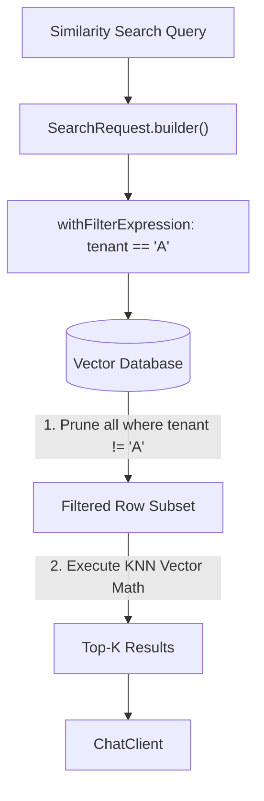

# Topic 30: Metadata Filtering in Vector Stores

## Overview
Searching purely by dense vector similarity is powerful, but often you need traditional precision to narrow down the search space. Metadata Filtering allows you to restrict the vector search strictly to subsets of documents, such as documents tagged with a specific `authorId`, `category`, or `date_range`.

## Real-World Analogy
Imagine trying to find a specific red shirt in a massive department store. Instead of looking at every single shirt in the store (Dense Vector Search), you immediately walk to the "Menswear" section on the "3rd Floor" (Metadata Filters), and *then* look for the red shirt. It drastically reduces the area you have to search.

## Architecture Flow


## Concepts
1. **Metadata Storage**: When persisting `Document` objects into a Spring AI `VectorStore`, you append structured Key-Value metadata.
2. **Pre-Filtering**: Using the database's native indexing to filter rows before performing the mathematical nearest-neighbor search. This drastically increases both performance and accuracy.
3. **Filter Expressions**: Spring AI introduces a portable filter expression language that gets translated uniquely to your underlying DB (Pinecone, Postgres, Neo4j, etc).

## Spring AI Portable Filter Expression
You can write an expression like `genre == 'sci-fi' AND year >= 2020` and Spring AI safely converts it.

```java
SearchRequest request = SearchRequest.defaults()
    .withQuery("What is the main plot?")
    .withTopK(5)
    .withFilterExpression("genre == 'sci-fi' AND year >= 2020");

List<Document> results = vectorStore.similaritySearch(request);
```
