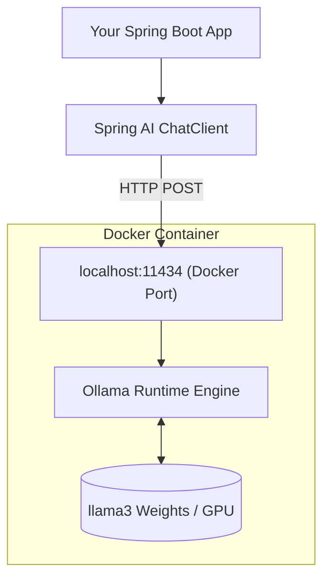

# Topic 30: Run AI Models Locally using Docker (Ollama)

Building AI applications using API keys for OpenAI, Google Gemini, or Anthropic is incredibly powerful, but it comes with challenges:
1. **Cost**: Every API call costs money (Tokens).
2. **Privacy**: You might not want to send your corporate PDFs (RAG data) to a public cloud provider.
3. **Connectivity**: You require constant internet access.

The solution is to run open-source AI models locally on your own machine (or private cloud deployment) using Docker and **Ollama**.

---

### What is Ollama?

Ollama is a lightweight application designed to run massive open-source Large Language Models (like Meta's `llama3`, Google's `gemma`, or Mistral) locally on your own hardware without needing a PhD in machine learning to configure them.

---

### Step 1: Running Ollama via Docker

You don't even need to install Ollama directly on your machine. You can spin it up securely using Docker.

Open your terminal and run:

```bash
# 1. Start the Docker Container
docker run -d -v ollama:/root/.ollama -p 11434:11434 --name ollama ollama/ollama

# 2. Enter the running Container and pull a specific Model
docker exec -it ollama ollama run llama3
```

*Note: The first time you run `ollama run llama3`, it will download the model files (usually 4 to 8 Gigabytes) to your local disk.*

---

### Step 2: Spring Boot Configuration

Once the Docker container is running and the model is downloaded, Ollama exposes a standard REST API at `http://localhost:11434`.

Spring AI provides a dedicated starter for this. In your `pom.xml`, simply add:

```xml
<dependency>
    <groupId>org.springframework.ai</groupId>
    <artifactId>spring-ai-starter-model-ollama</artifactId>
</dependency>
```

Then, configure your `application.yml` or `application.properties` to point to the Docker container:

```properties
# Tell Spring AI to use the Ollama Chat Provider
spring.ai.ollama.base-url=http://localhost:11434
# Tell Spring AI which model you downloaded
spring.ai.ollama.chat.options.model=llama3
```

---

### Flow Diagram: Local Architecture



---

### Summary
By containerizing Ollama, you achieve complete vendor independence. The exact same Spring AI `ChatClient` code we wrote in Topics 1 through 29 will work flawlessly with your local `llama3` instance. You just change the `pom.xml` dependency and the `application.properties` URL—zero Java code changes required. completely private, and completely free AI.
