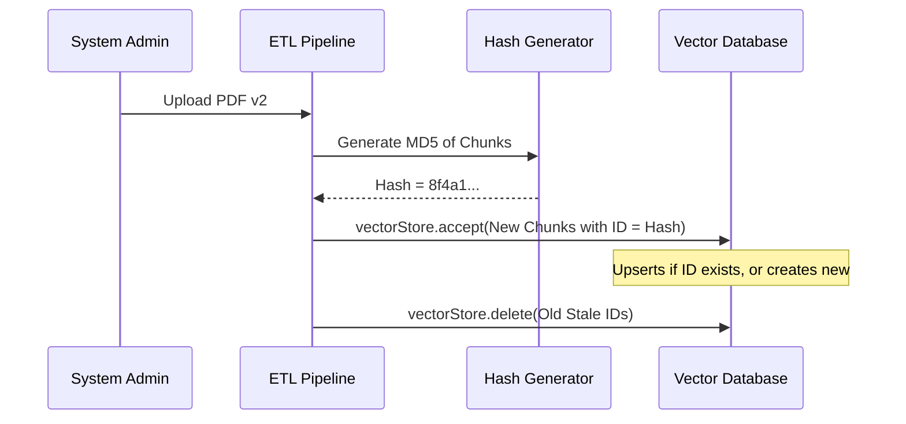

# Topic 31: Document Versioning & Re-Indexing

## Overview
When backing documents in a Vector database change (e.g., an internal PDF manual gets updated), the vector database must be synchronized. Failing to update embeddings leads to RAG hallucinations based on stale data.

## Real-World Analogy
Think of a phonebook. If a restaurant changes its phone number, you don't just write the new number in the margins (which causes confusion later). You scratch out the old entry entirely and write the new entry. Document Versioning ensures stale knowledge is physically deleted from the AI's "phonebook" so it never dials a dead number.

## Architecture Flow


## Concepts
1. **Document Fingerprinting**: Generating MD5/SHA hashes of chunks to detect if the text has actually mutated.
2. **Upsert Operations**: Inserting new embeddings while overwriting the old ones. Spring AI `VectorStore` relies on document `id` (usually a UUID) to perform upserts.
3. **Stale Deletion**: If a document is completely removed in the source, all chunks originating from it must be pruned from the DB.

## Implementation Guide
When ingesting documents through Spring AI's ETL pipeline, retaining tracing metadata like `source_file` and `version` allows targeted deletion before a fresh re-index.

```java
// 1. Delete old chunks related to a specific file
vectorStore.delete(List.of("doc-id-1", "doc-id-2")); // Note: exact ID pruning depends on DB

// 2. Or, construct documents with consistent deterministic IDs based on content hash
Document doc = new Document(digest.hash(textContent), textContent, Map.of("version", 2.0));
vectorStore.accept(List.of(doc)); // Overwrites old chunk natively if ID matches
```
