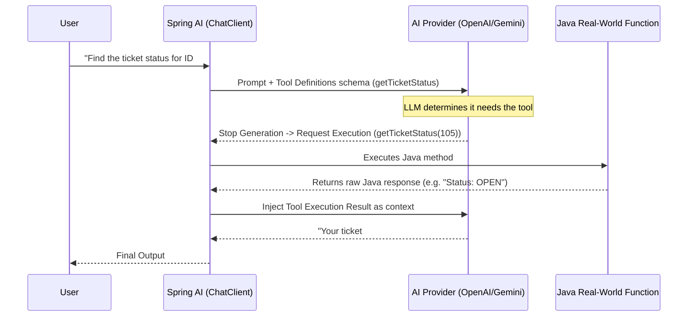

# Topic 31: Tool Calling in LLMs (How AI Gets Real-World Superpowers)

## Overview
By default, Large Language Models are confined to their training data and exist in a "frozen" time state. They cannot check live weather, query your secure SQL database, or trigger an API request. **Tool Calling** (also known as Function Calling) bridges this gap, giving your AI real-world "superpowers" by allowing the model to request the execution of predefined Java methods.

This topic covers the theory of Tool Calling, the `FunctionCallback` API in Spring AI, and how the LLM delegates tasks to your backend application.

## 🧠 Architectural Concept

1. **User Prompt**: "What is the weather in London right now?"
2. **System Setup**: We tell the LLM, "You have access to a tool called `getWeather`. It takes a `location` strictly as JSON."
3. **LLM Decision**: The LLM realizes it doesn't know the live weather. It pauses text generation and responds with a *Tool Call Request*: `{ "name": "getWeather", "arguments": { "location": "London" } }`.
4. **Backend Execution**: Spring AI intercepts this, executes your Java `java.util.function.Function`, and gets the result (e.g., `"15 degrees, cloudy"`).
5. **LLM Synthesis**: Spring AI sends the result *back* to the LLM. The LLM then generates the final natural language answer: "It is currently 15 degrees and cloudy in London."

### The Request Lifecycle (Mermaid Diagram)



## 💻 Spring AI Implementation Pattern

In Spring AI, any standard `java.util.function.Function` can become an AI tool using the `@Bean` and `@Description` annotations. 

### Step 1: Define the Function Bean
```java
public record WeatherRequest(String location) {}
public record WeatherResponse(String conditions, int tempCelsius) {}

@Bean
@Description("Get the current weather conditions for a given city.")
public Function<WeatherRequest, WeatherResponse> weatherFunction() {
    return request -> {
        // Real logic goes here (e.g., calling OpenWeatherMap API)
        return new WeatherResponse("Sunny", 25);
    };
}
```

### Step 2: Register it in the ChatClient

```java
String answer = chatClient.prompt()
        .user("Should I wear a jacket in Paris today?")
        .tools("weatherFunction") // Bind the Spring Bean by name
        .call()
        .content();
```

## ⚠️ Key Considerations

*   **Explicit Descriptions**: The LLM relies **entirely** on the `@Description` annotation and your `record` variable names to understand *when* and *how* to use the tool. If the descriptions are vague, the AI will fail to invoke it.
*   **Latency Cost**: Tool calling requires multiple round-trips to the AI provider. It first determines the tool, sends the request back, you process it, and it analyzes the output to formulate the answer.
*   **Security risks**: Never allow a direct destructive tool (like `sqlDropTable`) without human-in-the-loop approval. You are exposing backend execution to prompt commands.

## Summary

Tool Calling transforms an LLM from a simple text-generator into a highly-capable **Reasoning Engine** that delegates tasks to your robust programmatic backend logic.
