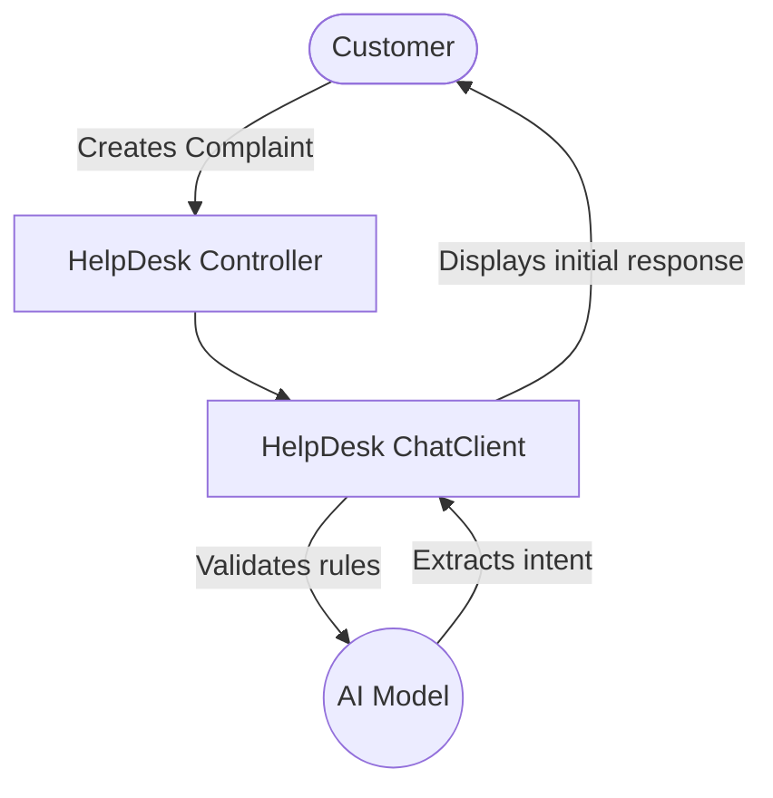

# Topic 33: AI Based HelpDesk Project (Part 1 - Boilerplate)

## Overview
Moving from isolated features to a cohesive, full-stack application, this module begins the **AI HelpDesk System**. 

The goal of this multi-part project is to construct a fully autonomous L1 Support Agent that can categorize user issues, check databases for existing support tickets, intelligently troubleshoot problems based on past company data, and escalate unknown issues to human representatives.

## 🏗️ Phase 1 Goals

1. **Domain Model**: Establishing the `Ticket` entity and its lifecycle (`OPEN`, `IN_PROGRESS`, `RESOLVED`, `ESCALATED`).
2. **Repository Layer**: Setting up the data access layer (e.g., JPA/H2 memory database) to simulate enterprise production environments.
3. **HelpDesk Persona Engine**: Constructing a high-level `ChatClient` wrapper strictly tuned for Customer Support using robust System Prompt constraints.

## 🧠 Designing the HelpDesk Persona

To prevent the HelpDesk bot from answering generic questions ("Help me bake a cake"), we must establish strict operational boundaries.

```java
@Configuration
public class HelpDeskAiConfig {

    @Bean
    public ChatClient supportAgentClient(ChatClient.Builder builder) {
        return builder
            .defaultSystem(
                "You are 'HelpBot', an L1 technical support representative for Acme Corp. " +
                "You must be exceedingly polite, highly analytical, and strictly professional. " +
                "Rules:\n" +
                "1. If a user asks a question unrelated to software support, politely decline to answer.\n" +
                "2. Always ask for clarification if an issue is vague.\n" +
                "3. Use concise bullet points for troubleshooting steps."
            )
            .build();
    }
}
```

## System Architecture for HelpDesk



## Summary
Part 1 establishes the strict conversational guardrails and basic Domain Driven Design for the ticket system. The bot is polite but *disconnected*. In Part 2, we will integrate Tool Calling so the bot can actually read from the database and alter ticket statuses autonomously.
