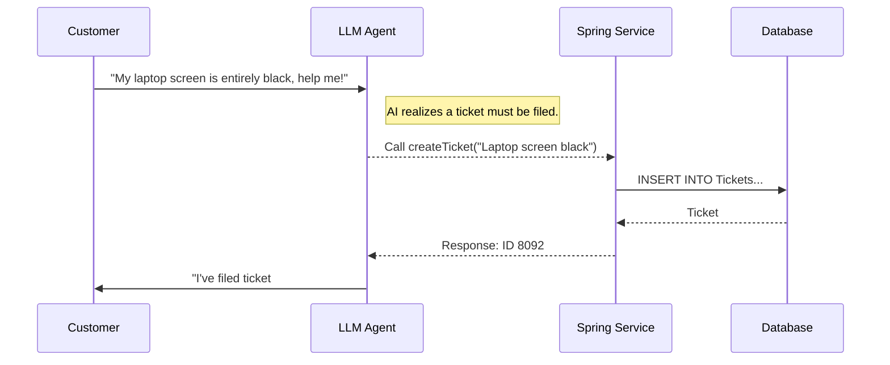

# Topic 34: AI Based HelpDesk System (Part 2 - Orchestration)

## Overview
With the domain models established in Part 1, Part 2 gives our HelpDesk Agent actual database integration using **Tool Calling**. Instead of just talking to the customer, the LLM will now execute database transactions seamlessly on their behalf.

## 🧠 The Agent Workflow

We will empower the AI model with three primary Spring `@Bean` functions:
1. `createTicket`: Translates customer rambling into a concise ticket summary and saves to DB.
2. `checkTicketStatus`: Finds a ticket given an ID.
3. `cancelTicket`: Closes the ticket early.

### Sequence Flow (Full Agentic Automation)



## 💻 Key Implementations

### Service Tool Bean

```java
// Registration of the Tool
@Bean
@Description("Creates a new technical support ticket. Requires a concise summary of the issue.")
public Function<IssueData, TicketReceipt> createTicketFunction(TicketRepository repo) {
    return issue -> {
        Ticket ticket = new Ticket(issue.summary(), Status.OPEN);
        repo.save(ticket);
        return new TicketReceipt(ticket.getId(), "Successfully Created");
    };
}
```

### Prompt Integration

The chat client connects the user to these capabilities instantly. 

```java
return helpDeskChatClient.prompt()
        .user(userInput)
        // Bind the tools to this conversation
        .tools("createTicketFunction", "checkTicketStatusFunction")
        .call()
        .content();
```

## Security Posture
When binding database mutations to an LLM, ensure your services handle invalid data robustly. Because LLMs are non-deterministic, they might pass empty strings or null values to your Java parameters if not strictly constrained by the `@JsonPropertyDescription`.

## Summary
The HelpDesk is now fully integrated with our database via tool calling. The bot no longer just chats; it processes business logic autonomously based on conversational intent.
