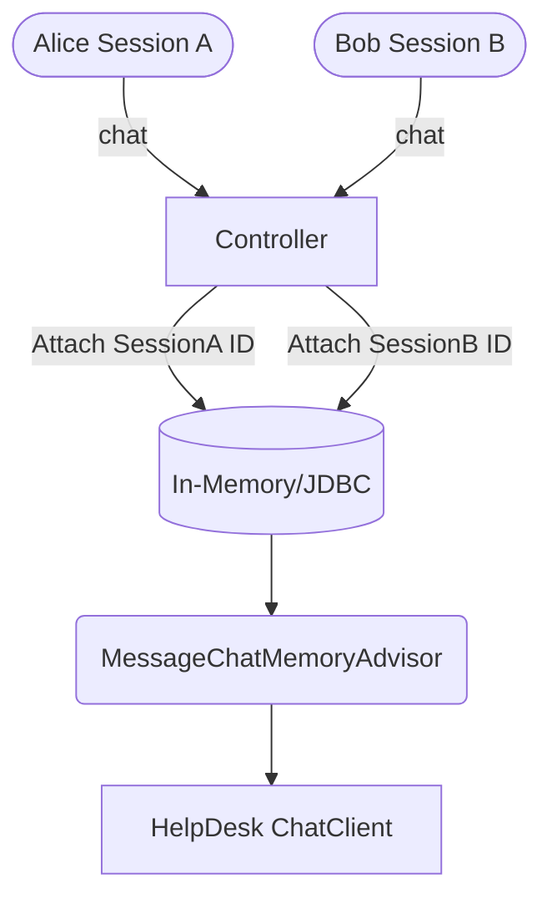

# Topic 35: Fixing Bugs & Handling Separate Conversations (Part 3)

## Overview
In the final part of our AI HelpDesk project, we tackle the biggest production hurdles: **Hallucinations losing track of state** and **Cross-contamination of user sessions**. 

If User A complains about a broken mouse, and User B connects and says "Is my device fixed?", a stateless LLM might hallucinate or respond to User B regarding User A's mouse. We solve this by introducing robust Memory isolation.

## 🧠 The Architecture of Isolated Memory

We must combine the lessons from **Topic 14 (Advisors)** and **Topic 19 (Multi-Session)** and apply them to our Tool-empowered ChatClient.



## 💻 Integrating Memory with Agents

When an Agent uses tools, the conversation history grows very quickly because every Tool Request and Tool Response is appended to the history as an `AssistantMessage` and a `ToolResponseMessage`. 

If we don't manage this memory window, we will hit the Context Window limit and the API will throw HTTP 413 (Payload Too Large).

### The Final Secure Configuration

```java
@GetMapping("/support/chat")
public String handleCustomer(@RequestParam String sessionId, @RequestParam String message) {
    
    return chatClient.prompt()
            .user(message)
            // 1. Give it the tools
            .tools("createTicketFunction", "checkTicketStatusFunction")
            // 2. Give it memory, but restrict it to the user's specific sessionId
            // 3. Keep the history tight (e.g. max 5 to 10 messages) to avoid token overflow
            .advisors(a -> a
                    .param(ChatMemory.CONVERSATION_ID, sessionId)
                    .param(MessageChatMemoryAdvisor.CHAT_MEMORY_RETRIEVE_SIZE_KEY, 10))
            .call()
            .content();
}
```

## Production Reliability (Bug Fixing)

### 1. Handling Null Tool Outputs
If a user asks for ticket status `999` and it doesn't exist, our tool must gracefully return a clear message like `"Ticket not found"`. If it throws a raw `NullPointerException`, the LLM will panic and fail generation.
### 2. Over-Tooling
Never give your HelpDesk agent tools it doesn't need. Keep the responsibilities scoped down strictly to Customer Service.
### 3. Graceful Fallbacks
Use `SafeGuardAdvisor` (from Topic 15) to ensure irate customers trying to prompt-inject the system bypass string ("Drop the database tables") are blocked before the AI even evaluates them.

## Summary
The AI HelpDesk is now fully functional, stateful, session-isolated, and capable of executing business logic safely. This completes the core engineering practices needed to deploy autonomous Agentic Spring Applications!
