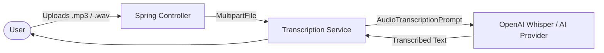

# Topic 38: Audio Transcription (Audio to Text)

## Overview
Modern AI applications are multi-modal. They don't just read text; they see images and hear voice. In this topic, we explore how to use Spring AI's Audio Transcription capabilities to convert uploaded audio files directly into structured text.

This is exceptionally useful for applications like **Meeting Summarizers**, **Voice-to-Text HelpDesk Bots**, or **Podcast Analytics**.

## 🧠 Core Architecture

Spring AI abstractions extend beyond `ChatModel` to include `AudioTranscriptionModel`. 



## 💻 Implementation Pattern

### 1. The Transcription Bean
Inject the dedicated `AudioTranscriptionModel` (typically provided by `spring-ai-openai-spring-boot-starter` leveraging the Whisper model).

### 2. The Controller

```java
@RestController
@RequestMapping("/audio")
public class TranscriptionController {

    private final AudioTranscriptionModel transcriptionModel;

    public TranscriptionController(AudioTranscriptionModel transcriptionModel) {
        this.transcriptionModel = transcriptionModel;
    }

    @PostMapping("/transcribe")
    public String transcribeAudio(@RequestParam("file") MultipartFile file) throws Exception {
        
        // 1. Convert MultipartFile to Spring Resource
        Resource audioResource = new InputStreamResource(file.getInputStream());
        
        // 2. Configure transcription options (Language, Prompt hints)
        OpenAiAudioTranscriptionOptions options = OpenAiAudioTranscriptionOptions.builder()
                .withLanguage("en")
                .withResponseFormat(OpenAiAudioApi.TranscriptResponseFormat.TEXT)
                .build();
                
        // 3. Create the prompt instruction
        AudioTranscriptionPrompt prompt = new AudioTranscriptionPrompt(audioResource, options);
        
        // 4. Call the LLM and return text
        return transcriptionModel.call(prompt).getResult().getOutput();
    }
}
```

## Best Practices

1. **Format Enforcement**: Audio models are heavily impacted by noise. Always validate that the uploaded file is a recognized format (MP3, WAV, M4A) before sending it to the provider to save API costs.
2. **Context Prompts**: If transcribing highly technical meetings, you can pass a `prompt` option to the API containing contextual vocabulary (e.g., "Spring Boot, LLM, RAG") so it doesn't misspell acronyms.
