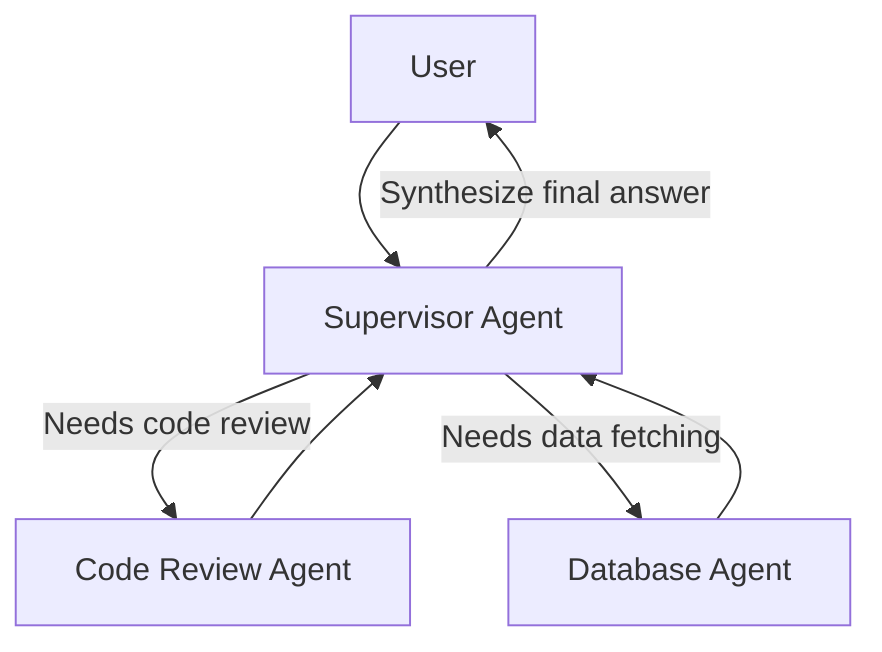

# Topic 39: Multi-Agent Orchestration

## Overview
A single prompt or agent typically struggles with complex, multi-step goals spanning different domains. **Multi-Agent Orchestration** is the architecture where specialized sub-agents collaborate to achieve a master objective, usually coordinated by a "Supervisor Agent".

## Concepts
1. **Supervisor vs. Workers**: The Supervisor breaks a query down. The "CodeAgent" executes code tasks, the "SearchAgent" queries the web, etc.
2. **State Management**: Passing context and intermediate outputs reliably between executing agents.
3. **Routing**: Utilizing LLMs to decide dynamically *which* sub-agent to invoke next.

## Real-World Analogy
Think of a restaurant kitchen. The Head Chef (Supervisor Agent) doesn't chop vegetables, grill the steak, and wash the dishes. When a multi-course dinner is ordered, the Head Chef delegates tasks: the Sous-Chef grills the meat, the Prep Cook chops onions, and the Pastry Chef makes dessert. Multi-agent architecture delegates tasks to specialized sub-agents instead of relying on one bloated agent to do it all.

## Architecture Flow

## Spring AI Context
Currently, robust multi-agent orchestration frameworks like LangGraph are popular in Python. In Spring AI, multi-agent flows can be manually achieved using multiple `ChatClient` instances hooked sequentially or iteratively via Spring WebFlux / Integration or simple Java logic.
