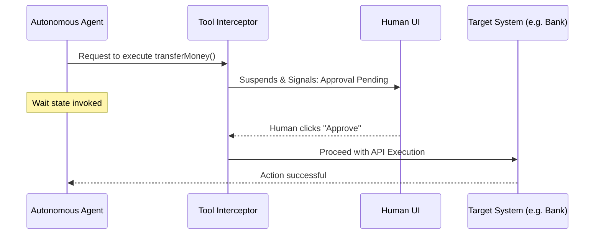

# Topic 40: Human-in-the-Loop Workflows

## Overview
Autonomous agents given carte blanche access to destructive tools (e.g., executing DB modifications, sending emails) pose catastrophic risks if they hallucinate. **Human-in-the-Loop (HITL)** architecture pauses an agent's execution right before an irreversible action, waiting for a human administrator to click "Confirm" or "Reject".

## Real-World Analogy
Imagine an autopilot flying a commercial jet. The autopilot can make 99% of the navigational adjustments on its own. However, right before the plane physically lands on the runway, the system flashes a light demanding the human pilot grab the yoke or press a confirmation button. HITL ensures the AI never performs high-stakes actions without a human co-signing it.

## Architecture Flow


## Concepts
1. **Execution Halting**: The agent process suspends state asynchronously.
2. **State Hydration**: When the human approves via an API call, the workflow loads from memory and proceeds.
3. **Safety First**: Crucial for Enterprise use-cases involving finance, infra-provisioning, or legal communications.

## Implementation Pattern in Spring
You can intercept tool executions by wrapping Spring AI `FunctionCallback`s to throw a `RequiresHumanApprovalException` communicating state to the frontend, or using an orchestrated saga pattern.

```java
// Conceptual Tool Wrapper
@Bean
@Description("Transfers money to a target account")
public Function<TransferRequest, String> transferMoney() {
    return (req) -> {
        if (!approvalService.isApproved(req.getTransactionId())) {
            // Signal hit to UI to prompt human
            throw new ApprovalPendingException("Human approval required for Transfer.");
        }
        return bankApi.transfer(req.getAmount(), req.getTarget());
    };
}
```
