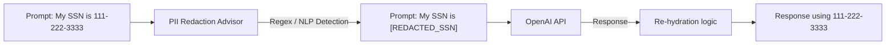

# Topic 42: PII Detection & Redaction

## Overview
Enterprise applications handling sensitive data cannot send raw Social Security Numbers, emails, or Medical Records to public multi-tenant APIs like OpenAI. Doing so violates strict compliance frameworks (e.g., GDPR, HIPAA, SOC2). **PII Redaction** anonymizes data before it leaves your internal infrastructure.

## Real-World Analogy
Imagine a movie script based on a true story. Before the script is published to the public, lawyers go through and black out the real names and actual addresses of the victims, replacing them with `[John Doe]` and `[123 Main St]`. PII Redaction is your system's automated lawyer, blacking out Private Data before the script arrives at OpenAI's public servers.

## Architecture Flow


## Concepts
1. **Detection**: Automatically identifying structured data (regex for SSN) or unstructured PII (Named Entity Recognition models) in user prompts.
2. **Redaction**: Replacing matches with placeholders like `[REDACTED_SSN]`.
3. **Rehydration (Optional)**: Swapping the `[REDACTED_SSN]` back to the real number when parsing the LLM response before sending it to the client.

## Implementing with Advisors
You can enforce redaction globally using a custom `CallAroundAdvisor` intercepting prompts in Spring AI.

```java
public class PiiRedactionAdvisor implements CallAroundAdvisor {
    @Override
    public AdvisedResponse aroundCall(AdvisedRequest request, CallAroundAdvisorChain chain) {
        String cleanMessage = redactSensitiveInfo(request.userText());
        AdvisedRequest safeReq = AdvisedRequest.from(request).withUserText(cleanMessage).build();
        return chain.nextAroundCall(safeReq);
    }
    
    private String redactSensitiveInfo(String text) {
        // Regex or Local NLP model logic replacing emails/SSNs
        return text.replaceAll("\\b[A-Za-z0-9._%+-]+@[A-Za-z0-9.-]+\\.[A-Z|a-z]{2,}\\b", "[REDACTED_EMAIL]");
    }
}
```
