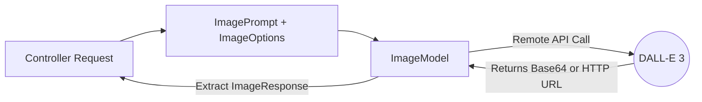

# Topic 44: Image Generation (DALL-E & Imagen)

## Overview
We've spent the entire course passing text back and forth. However, Spring AI features dedicated interfaces for Generative Art via `ImageModel`, `ImageClient`, and `ImagePrompt`.

Whether you want to generate dynamic blog post thumbnails, user avatars based on text descriptions, or product mockups, Spring AI unifies access to engines like OpenAI's DALL-E 3 and Google's Imagen.

## 🧠 The Architecture



## 💻 Spring Boot Implementation

### 1. The Controller

```java
@RestController
@RequestMapping("/art")
public class ImageGenerationController {

    private final ImageModel imageModel;

    // The ImageModel is auto-configured by your starter dependency
    public ImageGenerationController(ImageModel imageModel) {
        this.imageModel = imageModel;
    }

    @GetMapping("/generate")
    public String generateAvatar(@RequestParam String description) {
        
        // 1. Configure the request details (width, height, style)
        OpenAiImageOptions options = OpenAiImageOptions.builder()
                .withModel("dall-e-3")
                .withQuality("hd")
                .withN(1) // Number of images to generate
                .withHeight(1024)
                .withWidth(1024)
                .build();
                
        // 2. Create the prompt
        ImagePrompt imagePrompt = new ImagePrompt(description, options);
        
        // 3. Call the model
        ImageResponse response = imageModel.call(imagePrompt);
        
        // 4. Extract the generated Image URL
        return response.getResult().getOutput().getUrl();
    }
}
```

## Key Considerations

1. **Storage Formats**: Image models typically return the image either as a direct HTTP URL hosted on the provider's server (which usually expires in 1-2 hours) OR as a raw `Base64` encoded string.
2. **Persistence Strategy**: For production, you should download the image from the temporary URL and save it directly to your own AWS S3 bucket or local disk immediately.
3. **Cost Factor**: Generating a 1024x1024 HD image with DALL-E 3 is significantly more expensive than generating a paragraph of text. Always cache your generated images!

## Summary
The `ImageModel` API mirrors the simplicity of the `ChatModel` API, abstracting away the complex JSON payloads required by various providers and letting you generate rich visual media with a handful of Java object builders.
