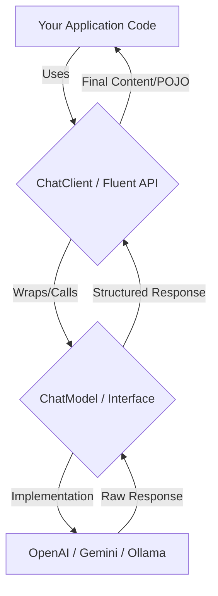

# Topic 5: Master ChatClient & ChatModel APIs

In Spring AI, you have two primary ways to interact with an AI model: **`ChatModel`** and **`ChatClient`**. While they might sound similar, they serve different purposes and offer different levels of abstraction.

---

### Real-World Analogy: The Expert vs. The Assistant

Imagine you need to get a complex legal document summarized.

- **`ChatModel` (The Expert/Professor)**: You go directly to a law professor. You have to prepare a formal request, handle all the raw data yourself, and wait for a very specific technical response. It’s powerful, but "verbose" and requires a lot of setup.
- **`ChatClient` (The Executive Assistant)**: You tell your assistant, "Hey, get me a summary of this document." The assistant knows how to talk to the professor, formats the request for you, handles the back-and-forth, and gives you exactly what you asked for in a nice summary. The assistant uses the professor behind the scenes.

---

### 🔍 Key Differences

| Feature | `ChatModel` | `ChatClient` |
| :--- | :--- | :--- |
| **API Style** | Strategy / Interface based | **Fluent / Builder** based |
| **Abstraction Level** | Low Level (Direct access to Model) | **High Level** (User-friendly) |
| **Best For** | Advanced customizations, low-level control. | **90% of standard use cases**, rapid dev. |
| **Infrastructure** | Foundational Interface. | Built *on top* of `ChatModel`. |

---

### ChatModel Implementation (The "Old" / Low-Level Way)
Requires manual handling of `Prompt` and `ChatResponse` objects.
```java
@RestController
public class ModelController {
    private final ChatModel chatModel;

    public ModelController(ChatModel chatModel) {
        this.chatModel = chatModel;
    }

    @GetMapping("/ask-model")
    public String ask(@RequestParam String message) {
        Prompt prompt = new Prompt(message);
        ChatResponse response = chatModel.call(prompt);
        return response.getResult().getOutput().getContent();
    }
}
```

### ChatClient Implementation (The "New" / Fluent Way)
Uses a modern, chainable API that is much more readable.
```java
@RestController
public class ClientController {
    private final ChatClient chatClient;

    public ClientController(ChatClient.Builder builder) {
        this.chatClient = builder.build();
    }

    @GetMapping("/ask-client")
    public String ask(@RequestParam String message) {
        return chatClient.prompt()
                .user(message)
                .call()
                .content(); // Simple, one-liner!
    }
}
```

---

### Flow Diagram: Architecture Overview



---

### Why prefer ChatClient?
1.  **Readability**: Chainable methods like `.user()`, `.system()`, `.advisors()`, and `.entity()` make code look like a sentence.
2.  **Advisors (Interceptors)**: Easily add logging, memory (history), or safety filters using `.advisors()`.
3.  **Entity Mapping**: `.entity(MyPojo.class)` automatically converts AI response to your Java object.
4.  **Builder Pattern**: Configure a base `ChatClient` once and reuse it across your controllers.

---

### How to Test
Try both the low-level Model API and the high-level Fluent Client API:
```bash
# Test Model API
curl "http://localhost:8080/topic-5/model?message=Explain+Spring+AI+briefly"

# Test Fluent Client API (Pirate Mode)
curl "http://localhost:8080/topic-5/client?message=Hello+how+are+you?"
```

---

### Summary
- Use **`ChatModel`** if you are building your own AI framework or need raw, low-level access to the model's metadata.
- Use **`ChatClient`** for building your applications. It’s cleaner, safer, and follows modern Spring "Fluent API" standards.
