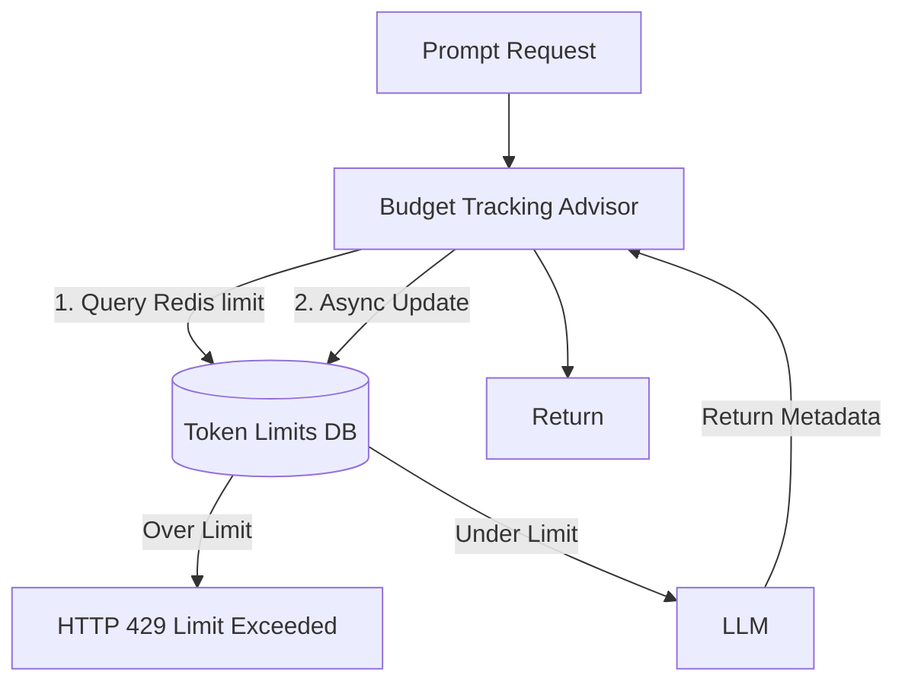

# Topic 57: Cost Budgeting & Token Limits

## Overview
A malicious actor (or a poorly written script) repeatedly hitting an AI endpoint can accidentally rack up thousands of dollars in API charges due to massive prompt inputs. Cost budgeting prevents unbounded API consumption per user, per IP, or per tenant.

## Real-World Analogy
Imagine giving your teenager a credit card. Instead of giving them an unlimited Black Card that could bankrupt you if they buy a sports car (Rate Limiting doesn't prevent this if they just make one huge purchase), you give them a pre-paid debit card with exactly $50 on it (Token Budgeting). The card naturally declines the moment they hit the physical limit.

## Architecture Flow


## Concepts
1. **Token Tracking**: Tallying the number of `prompt_tokens` and `completion_tokens` returned in the `ChatResponse` metadata.
2. **Rate Limiting vs Budgeting**: Rate limiting focuses on requests per minute. Budgeting focuses on financial dollars or absolute tokens allowed per day.
3. **Hard Caps**: Applying Advisors to abort calls dynamically if a user goes over their daily token allocation.

## Tracking via Spring AI Advisor
Extracting usage metrics from the response:

```java
public class CostTrackingAdvisor implements CallAroundAdvisor {
    private TokenRepository repository;

    @Override
    public AdvisedResponse aroundCall(AdvisedRequest request, CallAroundAdvisorChain chain) {
        // Evaluate pre-flight budget. Throw 429 if exceeded.
        checkBudget(request.getUserId());
        
        // Execute LLM call
        AdvisedResponse response = chain.nextAroundCall(request);
        
        // Track the spent tokens
        Usage usage = response.chatResponse().getMetadata().getUsage();
        repository.incrementTokenUsage(request.getUserId(), usage.getTotalTokens());
        
        return response;
    }
}
```
