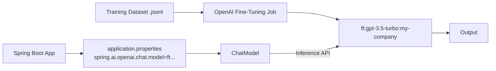

# Topic 59: Fine-Tuned Model Integration

## Overview
While Prompt Engineering and RAG are excellent for grounding an LLM dynamically, **Fine-Tuning** permanently alters the weights of a base model entirely. It trains the model on millions of specific structural examples (e.g., transforming plain-text descriptions directly into complex domain-specific JSON graphs) thereby removing the need for hefty prompts.

## Real-World Analogy
Imagine training a new employee. **Prompt Engineering** is like handing them a 50-page instruction manual they have to constantly read while doing the job. **Fine-Tuning** is like sending them to a 4-year university. The knowledge becomes baked into their brain—they no longer need the heavy manual to do the specific job correctly.

## Architecture Flow


## Concepts
1. **When to Fine-Tune**: Use it when the *format/behavior* needs teaching. Use RAG when *knowledge/facts* need teaching.
2. **Custom Model Identifiers**: After uploading a dataset to OpenAI or Vertex AI and running a fine-tuning job, you receive a unique model identifier like `ft:gpt-3.5-turbo-0613:my-company:my-custom-model`.
3. **Reduced Latency/Cost**: Fine-tuned models don't require massive 30-shot examples in the system prompt, massively saving input tokens.

## Integrating With Spring AI
You don't need a special API to use fine-tuned models. You simply override the default `model` configurations in `application.properties` with your custom identifier.

```properties
# Using an OpenAI fine-tuned model natively
spring.ai.openai.chat.options.model=ft:gpt-3.5-turbo-0125:company-x:support-bot-v1:8abcD
spring.ai.openai.chat.options.temperature=0.2
```

In Java, accessing this through the `ChatClient` is treated identically to querying standard `gpt-4o`.
