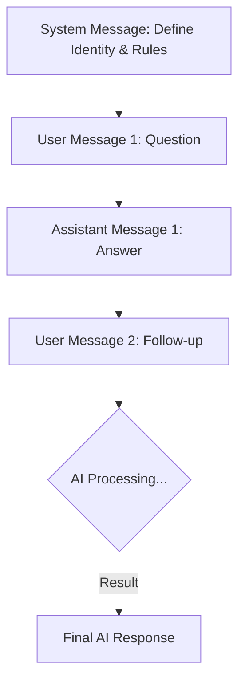

# Topic 7: Important AI Concepts for Projects

To build production-ready AI applications, you need to understand the "knobs and dials" that control how AI thinks, costs, and behaves. Let's explore the core concepts every developer must know.

---

### Real-World Analogy: The Chef's Kitchen

1.  **Tokens (The Ingredients)**: You pay for every ounce of flour and sugar (Tokens) used. If you want a giant cake, it's going to cost more and take longer to bake (**Context Window**).
2.  **Temperature (The Heat)**:
    - **Low Heat (0.2)**: Precise and consistent. Use for baking bread where exact measurements matter (**Data Analysis, Coding**).
    - **High Heat (0.8+)**: Sizzling and unpredictable. Use for creative stir-fry where you want flair and surprise (**Creative Writing, Brainstorming**).
3.  **System Message (The Recipe/Persona)**: "You are a French pastry chef." This sets the entire style and rules of the kitchen (**The Persona**).

---

### Core Concepts

#### 1. Tokens & Context Window
LLMs don't read words; they read "Tokens" (chunks of characters).
- **Cost**: APIs (OpenAI, Gemini) charge per 1k or 1M tokens.
- **Limit**: Every model has a "Context Window" (e.g., 128k tokens). If your request + previous history exceeds this, the AI will start "forgetting" the beginning of the conversation.

#### 2. Temperature (0.0 to 1.0)
Controls the **randomness** of the response.
- **`0.1` (Conservative)**: Always picks the most likely next word. Great for factual tasks or code.
- **`0.7+` (Creative)**: Picks less likely words. Great for writing stories, poems, or ideas.

#### 3. System vs. User vs. Assistant Messages
- **System Message**: Sets the behavior rules ("You are a helpful customer support agent for a bank").
- **User Message**: Your actual question ("How do I reset my password?").
- **Assistant Message**: The AI's response (Useful for feeding conversation history back into the model).

---

### Flow Diagram: The Messaging Stack



---

### Implementation in Spring AI (Fluent API)

You can set these options globally in `application.properties` or per-request in Java.

```java
@GetMapping("/creative-story")
public String getStory() {
    return chatClient.prompt()
            .system("You are a professional sci-fi author.") // SET PERSONA
            .user("Write a 1-sentence story about a robot on Mars.")
            .options(OpenAiChatOptions.builder()
                .withTemperature(0.9f) // HIGH CREATIVITY
                .withMaxTokens(200)    // LIMIT COST
                .build())
            .call()
            .content();
}
```

---

### Best Practices
- **Token Economy**: Be concise in your prompts. Long prompts cost more and slow down the app.
- **Zero-Shot vs. Few-Shot**:
    - **Zero-Shot**: "Translate 'Hello' to French."
    - **Few-Shot**: "Translate 'Hello' -> 'Bonjour'. Translate 'Goodbye' -> 'Au revoir'. Translate 'Help' -> [?]" (Providing examples helps the AI perform much better).
- **Temperature for RAG**: When doing Retrieval Augmented Generation (RAG) on your data, keep temperature low (around `0.2`) to ensure factual accuracy.

---

### Summary
- **Tokens** = Your Budget and Memory.
- **Temperature** = Consistency vs. Creativity.
- **System Message** = The AI's "Job Description."
Understanding these ensures you build apps that are both cost-effective and accurate.
