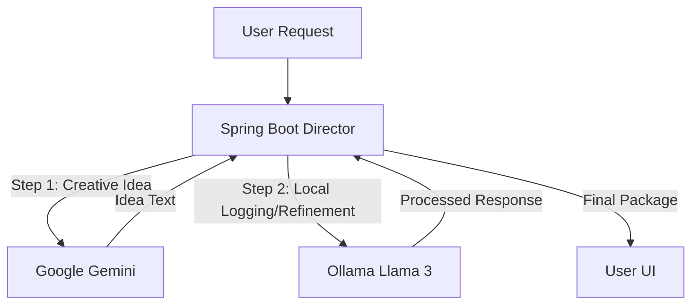

# Topic 8: Working with Multiple Models Together

In a real-world project, you rarely use just one model. You might use **Gemini** for its large context window, and **Ollama** for running local, private models for free. Spring AI makes it incredibly easy to "Mix and Match" models in a single project.

---

### Real-World Analogy: The Dream Team

Think of your application as a **Movie Production Crew**:
1.  **The High-End Consultant (Google Gemini)**: Elite writing and logic.
2.  **The Local Intern (Ollama / Llama 3)**: Handles quick, non-sensitive tasks for free (like basic categorization).

You (the developer) are the **Director**, telling each expert when to perform their task.

---

### Flow Diagram: Orchestration Workflow



---

### Configuration for Multiple Models

You can include multiple starters in your `pom.xml`.

```xml
<!-- Google GenAI Starter -->
<dependency>
    <groupId>org.springframework.ai</groupId>
    <artifactId>spring-ai-google-genai</artifactId>
</dependency>

<!-- Ollama Starter -->
<dependency>
    <groupId>org.springframework.ai</groupId>
    <artifactId>spring-ai-ollama-spring-boot-starter</artifactId>
</dependency>
```

#### application.properties
```properties
# Google Gemini Config
spring.ai.google.genai.api-key=${GOOGLE_API_KEY}

# Ollama Config (Local)
spring.ai.ollama.base-url=http://localhost:11434
```

---

### Orchestration in Java

Spring AI provides `@Qualifier` to distinguish between different models when multiple are present.

```java
@Service
public class MultiModelService {

    private final ChatModel geminiModel;
    private final ChatModel ollamaModel;

    public MultiModelService(
            @Qualifier("googleGenAiChatModel") ChatModel geminiModel,
            @Qualifier("ollamaChatModel") ChatModel ollamaModel) {
        this.geminiModel = geminiModel;
        this.ollamaModel = ollamaModel;
    }

    public String generateContent(String topic) {
        // Step 1: Use Gemini for high-quality text
        String story = geminiModel.call("Write a pitch for a story about " + topic);

        // Step 2: Use Ollama to log locally (No cost)
        ollamaModel.call("Logging content creation for topic: " + topic);

        return story;
    }
}
```

---

### Advanced Scenario: Fallback Support
You can create a "Smart Fallback" system. If Gemini fails (due to budget or outage), your code can automatically catch the exception and call Ollama as a backup.

#### Fallback Logic Example:
```java
public String askAI(String prompt) {
    try {
        return geminiModel.call(prompt); // Primary
    } catch (Exception e) {
        return ollamaModel.call(prompt); // Free Backup
    }
}
```

---

### How to Test
Test the orchestration logic (Hybrid vs Fallback):
```bash
# Test Hybrid Strategy (Gemini + Ollama)
# Calls Gemini for ideas and Ollama for a summary
curl "http://localhost:8080/topic-8/hybrid?prompt=Future+of+Space+Exploration"

# Test Fallback Strategy
# Tries Gemini first, if it fails (e.g. invalid key), it calls Ollama
curl "http://localhost:8080/topic-8/fallback?prompt=Help+me+debug+this+Java+error"
```

---

### Summary
- **Independence**: Each model lives in its own "Starter" but works under a unified API.
- **Portability**: You can swap out your "Script Writer" from Gemini to OpenAI by just changing a qualifier and properties.
- **Cost/Privacy Balance**: Use Cloud models for the heavy-lifting and Local models for background processing.

**Congratulations!** You now know how to build complex, multi-model AI systems using the Spring framework.

