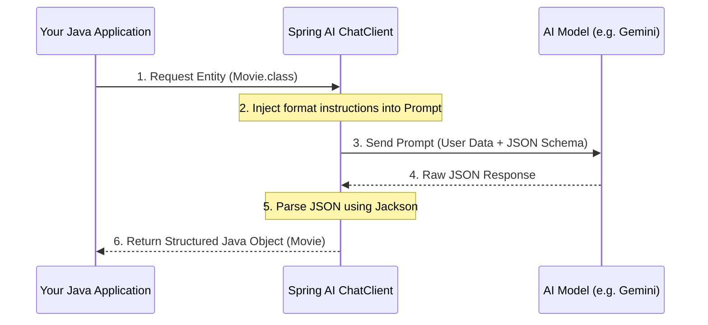

# Topic 9: Output Parsing (Entities & Lists)

In previous topics, we received AI responses as raw strings. However, in real-world applications, we need structured data (JSON or Java Objects) to build features like dashboards or data processing pipelines.

---

### Real-World Analogy: The Architect & The Building Blocks

Imagine you ask an architect for a house design.
- **Raw String Response**: They send you a 50-page letter describing the house in words. It's beautiful, but you can't realistically give those words to a construction crew to build the house.
- **Output Parsing**: They send you a **Structured Blueprint** (The Java Object). It has clear sections for "Dimensions", "Materials", and "Floors". You can hand this blueprint directly to your crew (your application code) because they know exactly how to read it.

---

### Key Components in Spring AI

#### 1. `BeanOutputParser<T>` (Mapping to POJOs)
This parser tells the AI to return data in a specific JSON format, which Spring AI then automatically converts into your Java class or record.
- **Analogy**: A mold for a chocolate bar. No matter how the chocolate is melted (the AI's response), it always comes out in the shape of the mold (your Java class).

#### 2. `ListOutputParser` (Mapping to Lists)
Useful when you want a simple list of strings or objects.
- **Analogy**: A shopping list. High-level items separated clearly.

---

### Implementation Example (Bean Mapping)

#### 1. Define the Entity (Record)
```java
public record Movie(String title, String genre, int yearOfRelease) {}
```

#### 2. Use the Parser in a Controller
```java
@GetMapping("/movie")
public Movie getMovieDetails(@RequestParam String movieName) {
    var parser = new BeanOutputParser<>(Movie.class);

    return chatClient.prompt()
            .user(movieName)
            .call()
            .entity(Movie.class); // Spring AI handles the manual parsing!
}
```

---

### Flow Diagram: Output Parsing Lifecycle



---

### Best Practices
- **Use Records**: Spring AI works perfectly with Java Records, which are immutable and concise.
- **Clear Descriptions**: If your POJO field names are vague, add descriptions to help the AI understand what data goes where.
- **Low Temperature**: When parsing entities, use a **low temperature (e.g. 0.2)** to ensure the AI follows the schema strictly.

---

### How to Test
See how Spring AI parses raw AI text into Java Records and Lists:
```bash
# Test Entity Mapping (Returns a Movie Record)
curl "http://localhost:8080/topic-9/movie?movieName=Inception"

# Test List Mapping (Returns a List of Strings)
curl "http://localhost:8080/topic-9/movies-list?actor=Leonardo+DiCaprio"
```

---

### Summary
Output parsing is what turns a "Chatter" into a "Service". By converting words into objects, you enable your Spring Boot application to perform logic, save to databases, and build structured APIs.
